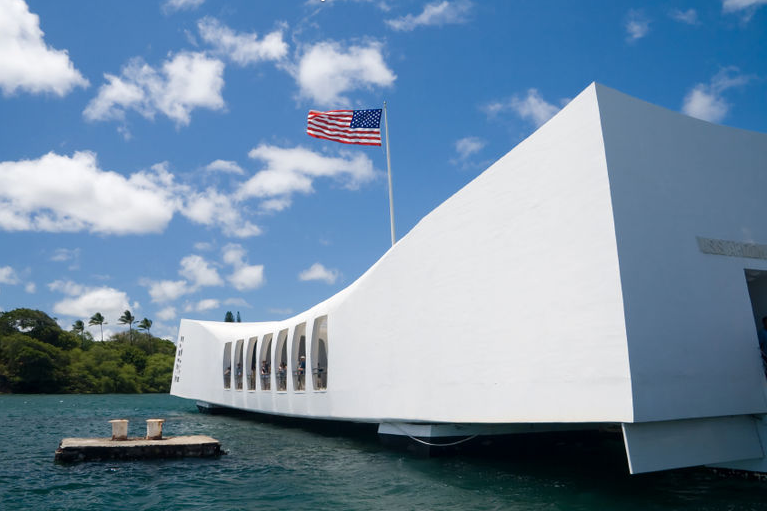

#################
Pearl Harbor Day!
#################

:date: 2009-12-07
:tags: Veterans, History

Monday, December 7th, 2009

It seems odd to be writing in my blog on this day. As a retired member of the
Armed Forces, this day has obvious significance to me, and to anyone who has
visited the Arizona Memorial at Pearl! I took my wife there several years ago,
and on the day we visited, one of the crewmen who lived through that day was
being laid to rest at the memorial. It was a moving experience.

Oddly, many of the visitors with us that day were Japanese – and it was amazing
to see and hear those visitors. They were just as respectful about our losses
that day as they were about their own. Time does heal old wounds in many a
heart.

You owe it to yourself to visit Pearl, and the memorial cemetery at Normandy
Beach if you get a chance. I have been to both, and grew up listening to
stories told by those of my parents generation who served during World War II.
Unfortunately, many of you growing up now have no idea what men and women did
to preserve freedom in that time in our history.

Respectfully,

Roie Black, Major, United States Air Force (Retired)
