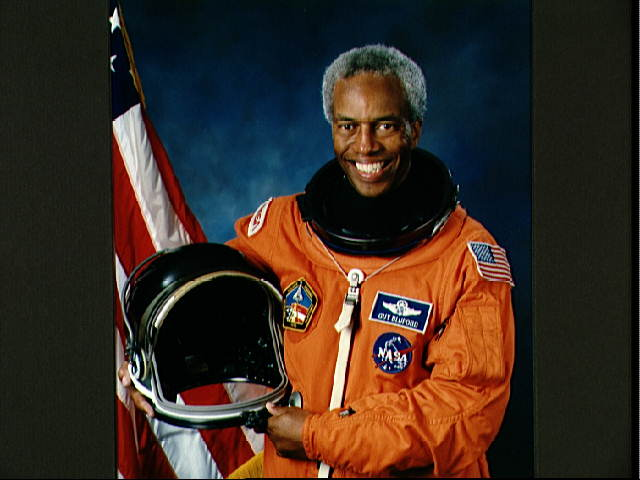
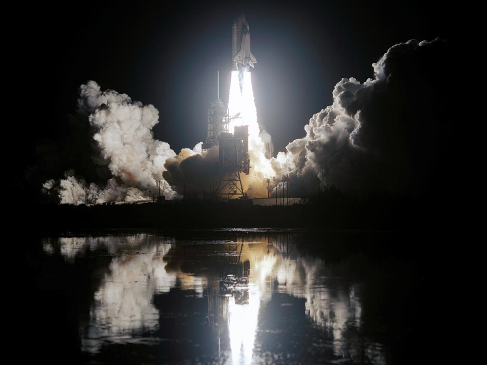
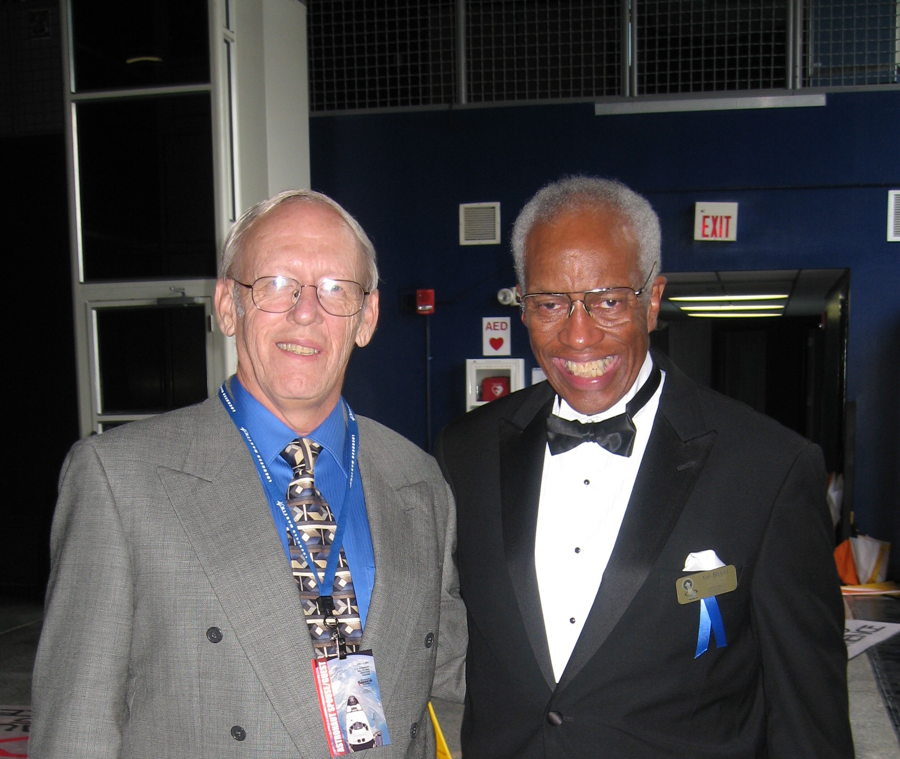

##########################
ACC Welcomes Guion Bluford
##########################

:date: 2011-02-18
:tags: Space, Veterans, History

Way back when I was a young officer in the USAF, I was assigned to a research
group in the Air Force Flight Dynamics Laboratory at Wright Patterson Air Force
Base in Dayton, Ohio. I was working on my PhD in Aerospace engineering (from
Virginia Tech). Another young officer, Guion S. Bluford, joined the group I was
in to complete his work on a PhD from the Air Force Institute of Technology
(where I eventually ended up teaching!). We spent several years working
together, learning how to do this amazing research in how to design advanced
aircraft using state of the art computers, and becoming friends. It was a great
time for both of us!

Guy was a dreamer! We both shared a passion for flying and technology. Growing
up, Guy’s heroes were the Tuskegee Airmen , a squadron of African American
pilots who flew amazing missions during World War II, and he wanted to be a
pilot. He succeeded in becoming a fighter pilot, flying missions in Viet Nam,
and had been an instructor pilot in my favorite airplane, the F4 Phantom II.
But Guy was not done with his incredible adventures!

While we worked together, Guy applied to be an astronaut. Wonder of wonders,
NASA invited him down the the Cape for an interview. I still remember his
stories about that trip! He was accepted by NASA and became the first
African-American to join the Shuttle Astronaut program. When all that happened,
all of us in the office told Guy we would be there for his first launch. We
ended those days with Guy heading off to start his training, and I went off to
teach at AFIT. We all got invitations from Guy as his first launch approached,
and in August 1983, we all gathered at the Cape, spent the evening with the
families of the Shuttle crew at the Officer’s Club at Patrick AFB, and then sat
out a rain storm until about 2AM when we got to see the first night launch of a
Shuttle, and the first trip by our friend, Guion S. Bluford. That trip
propelled him into history!

Over the years, I got to talk to Guy a number of times, once almost missing a
connection in Houston when he and I talked on the phone for quite a while. He
had just finished a mission that included an experiment flown for the Phillips
Space Research Laboratory, where I was managing a supercomputer.

Then we both retired and I lost touch with him. A few years ago, I was surfing
for names from my past on Facebook, and stumbled on a new entry. Guy was
online! We connected once again and caught up with each other. Then last
summer, I got a letter with an invitation to attend the induction of four
astronauts into the U.S Astronaut Hall of Fame, and Guy was one of those being
inducted. I ended up joining Guy and his wife at the event and had the time of
my life, hanging out with over 30 astronauts from Mercury to the Shuttle!

I asked Guy if he would be willing to join us at ACC as part of Black History
Month, and he agreed to do so. When I got back to school, I handed off the job
of getting the school to formally invite him to Marilyn Lee Taylor, who always
works on Black History Month for ACC, and she got things rolling.

Guy is visiting ACC this week, on Wednesday, Feb 23, at the Eastview campus. He
will talk and visit from 12:00 until about 2PM. Please join us and meet a true
American Hero, and a real roll model for our youth!

Welcome Guy, good to have you visit! Say hi to Linda for me!

