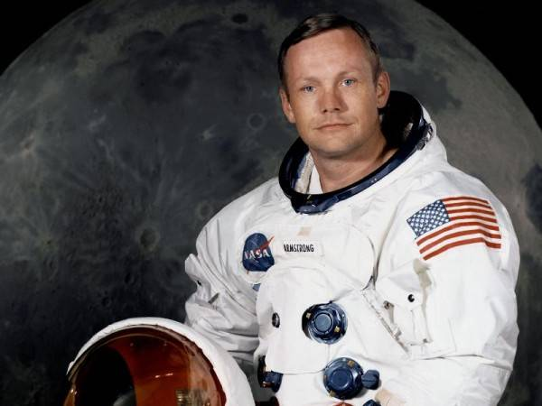

##########################
Remembering Neil Armstrong
##########################

:date: 2012-08-26
:tags: Aviation, Space, History

Today is a sad day for all those who dream of space travel. Neil Armstrong, the
first human to walk on the Moon, died in in his home state of Ohio.

As a kid, and even today, I read science fiction, and have always had a passion
for aviation and space. That passion took me into the world of aerospace
engineering and eventually a career in the United States Air Force where I got
to work with advanced aircraft and missiles. 

But I still remember July 20, 1969 when I sat glued to a television
while we watched Neil step off the lunar lander and place the first human foot
on the Moon!

I was just finishing my studies in Aerospace Engineering at Virginia Tech, and
about to start off on my graduate studies on a NASA fellowship when Neil and
Buzz Aldrin made history. (Their crew-mate, Mike Collins remained on the Apollo
command module, but should not be forgotten for his contributions).

We all breathed a sigh of relief when the lunar module blasted off from the
Moon and our astronauts were safely on their way back to Earth, and another
sigh when they splashed down a few days later.

When I finally finished graduate school and started work in the USAF, I got a
job doing advanced research in Computational Fluid Dynamics at Wright-Patterson
AFB in Ohio. I drove up to Wapakoneta, Ohio, Neil's home town to visit his
newly constructed `space museum <http://www.armstrongmuseum.org>`_ and see the plane he learned to
fly in. That was certainly fun, but a few years later, I got to meet Neil in
person.

Our research group worked with several professors at the University of
Cincinnati, and it turned out that the chairman of the Aerospace Engineering
department had been a member of my graduate committee at Virginia Tech. We got
an invitation to visit the department, and that happened shortly after Neil
joined the department as a distinguished member of the faculty. We walked into
his office and got to spend a half an hour just visiting and talking about what
is was like to find yourself one of the most famous men on the planet. He was a
humble man, and very gracious during our visit. I had touched a Moon rock at
the opening of the National Air and Space Museum in D.C brought back by Neil and
Buzz, so shaking his hand was a special treat.

Many years later, I also got to meet Buzz Aldrin, so I have shaken the hands of
both men on that mission.

Today, NASA celebrates the Curiosity Rover on Mars, but mourns the loss of a
distinguished astronaut. Rest in peace, Neil!

