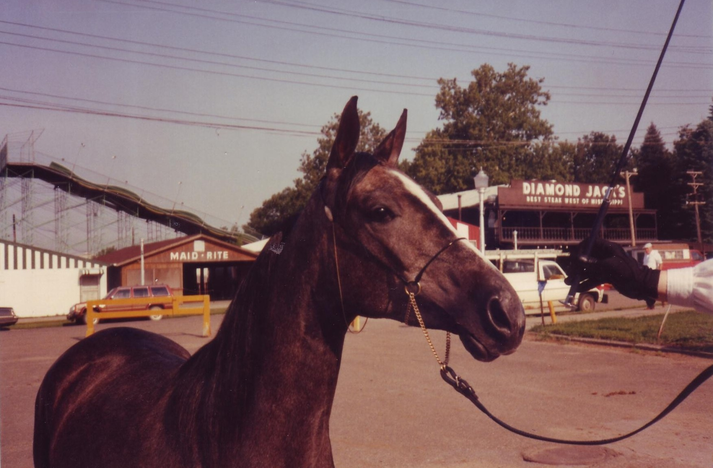

#####################
End of my Cowboy Life
#####################

:date: 2012-11-29
:tags: Horses, Stories

Today was a sad day for me. My last horse, a purebred Aradian named LAR Ali
Moraj, but known as Raji for most of his life, laid down in his pasture and
died. He was 26 years old.

..  image:: raji.JPG
    :alt: Raji in pasture
    :align: center
    :width: 500

That is a long time to have an animal be a part of your life. 

Cyra
====

Raji was part of
a deal we made when we traded Cyra, the first
born filly from my mare, Gazi. 

Gaizi's dad was a Polish race horse with an outstanding track record! This
image shows Cyra at the Iowa State Fair where she was entered in a class of
two-yer old fillies. She was too young to ride, but she was starting to look
pretty good. Sometime after this show, we ran into some folks from Fort Worth
who wanted to raise Arabian race horses. Cyra had had an illness before she was
one year old, which softened the tendons in her rear legs, so she was not going
to be a race horse, but she had the right blood lines to raise babies who could
race!

So, we negotiated a trade, Cyra would go to Texas, and we got Alietta, a show
quality Arabian mare and her current baby colt named Raji. We also go a
rebreading for another baby as part of the deal. Three for one, not bad (until
you have to pay the bills). 

Moving to Council Bluffs
========================

Raji was barely a year old when we got him, and he moved to Council Bluffs Iowa
with his mother to join our small herd of Arabians at Pony Creek Farm. 

Quite a shock to end up in 200 acres of Iowa grassland after living in a small
ranch in Texas!

Raji lived most of his life at Pony Creek with many of his friends. I never
wanted him to live in a small stall, so he was able to live his life the way
horses are meant to live, free to roam as he wished and hang out with his
friends.

When I retired from the Air Force, I moved back to Omaha, and Raji had grown up
into a nice horse. But my time was limited, and I never got around to trying to
ride him. Raji stayed a horse! I am sure he was fine with that!

Here he is in training to make sure he got first dibs on carrots whenever I
showed up. I went through one or two bags of carrots whenever I visited, so I
was pretty popular!

Wedding Visit
=============

When Cheryl and I decided to get married, we took many of the wedding party to
visit the horses at Pony Creek. Raji thinks my sister's leg smells funny!

It sure is tough being in a horse family with folks who have never seen a horse
before. My nephew is not sure he likes this.

..  image:: Raji-1998-2.jpg
    :alt: Raji Cinnie and Erik in 1998
    :align: center
    :width: 500

(Actually, that is not Raji there, but one of his friends)

It does help if they keep feeding you, always a good way to get on a horse's good side!

Raji in his later years
=======================

After Cheryl and I moved to Texas, we left Raji behind, along with my other
horse, Gaizi. They both continued to live in their favorite pasture. Jayna was
a good substitute mom for both of them, and made sure they were well cared for.
We exchanged letters to make sure things were going well. Here is one from just
before Gaizi moved back to Iowa.

We both have a weird sense of humor, that is why we have worked together for
almost 30 years! There is no place I would rather keep a horse!

Here is my pal on one of my irregular visits to Omaha after moving to Texas:

That muddy mess in the middle is Gazi, my favorite mare!

Trials and tribulations
=======================

Raji went through a number of trials in his life, but was a strong horse through
it all. He managed to poke a stick into one eye when eating in a hay bale, and
had to suffer the indignity of wearing a bottle strapped to his head with a
tube on antiseptic fluid dripping down onto his eye. He had a bright red ACE
bandage holding the entire thing on, and looked pretty silly. But it saved his
eye, and all he ended up with was a cloudy spot on one side, which did not hurt
his vision.

What was weird about this, was that Raji was actually taking after his mom! We
moved her to Albuquerque and placed her in a small horse farm near the Rio
Grande River. I kept Gaizi there as well. One day, we turned Alietta loose in a
sandy pen and she took off running as fast as she could. Her feet slipped out
from under her and she fell on her side and slid head-first into a fence post.
It almost knocked her out! When she got up, her forehead was kind of caved in a
bit. Yikes!

We called the vet who examined her, eventually doing an X-Ray to make sure
nothing was really seriously damaged. As it turned out, we had to wrap her head
in a (you guessed it) red ACE bandage with a small sponge to make sure the skin
over her new head dent stuck down while the whole area healed. Like mother like
son! (She was fine after that, just no good for racing, but she was a show
horse who did not run much.)

Another time, he got a bad case of Strangles, which is a nasty illness horses
get that makes it tough for them to bend over to eat. MY wife and I were
visiting him during this time and he walked over to a water tank which was
pretty low on water. He looked at the tank, then looked at us, and staring us
directly, kicked the tank to let us know we had to do something for him. Smart
little critter! We filled the tank so he could drink!

I visited Raji a few months ago and he bounded over to see his favorite person
(with the ever present bag of carrots!) He brought a few of his friends along
to share the feast. He seemed pretty healthy, although he was getting along in
years. I did not know it was the last time I would see him.

Raji's time
===========

Jayna, his care-taker for most of his life, called me this morning to tell me
of his passing. We both knew this day would be coming soon. She said he was in
charge of the herd the day before when she checked on things, and she found him
this morning, laying peacefully in the pasture. His friends were with him, and
no, he is not in this picture! It just seemed like a good view of Raji's world.

It was his time to go, and he went with no pain.

Thanks, Raji, for all the times we spent together, I will miss you. I hope you
had a good life, at least as good as I could give you!

Say hi to Gaizi for me, and I hope you find all the carrots you want.

Your carrot man: Roie

