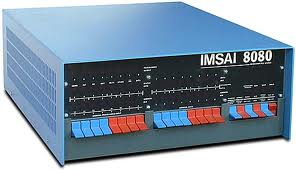
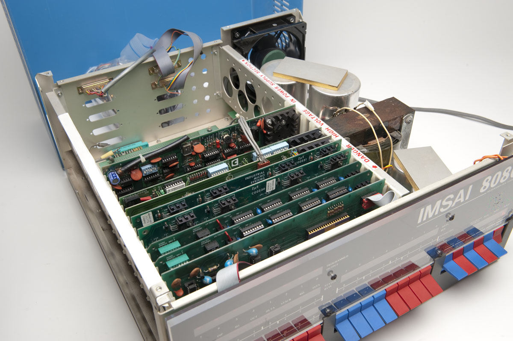
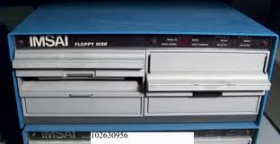
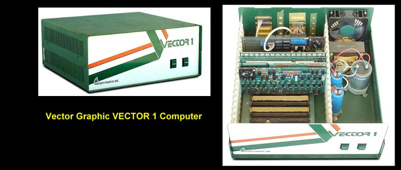
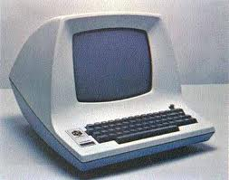

###################
Computers and Music
###################

:date: 2013-01-27
:categories: Life
:tags:: Computers, History, Music

This post is Pedro's fault. Yesterday, while surfing the net, I ran into Pedro
Kroger's blog. Pedro has authored a nice book titled `Music for Geeks and
Nerds <http://pedrokroger.net/2012/07/music-for-geeks-and-nerds/>`_ . He uses
Python to generate code that plays music. I got a copy of the book, and spent
some time reading it, and remembering musical moments from my past.

My folks never had the money to let me take music classes back when most folks
do that (grade school is the right time to start), so I missed my chance to be
a rock star. Instead I became an engineer.

This story is about music, I promise. But it will take a while to get there.
First, a bit of my history.

**********************
My first home computer
**********************

I entered the USAF in August, 1973 and started working in the Hypersonic
Aerodynamics Group at the USAF Aerospace Research Lab at Wright-Patterson AFB,
in Ohio. My assignment had been set up by Dr. Wilbur Hankey, who saw my
research at Virginia Tech, and decided I would be a good candidate to join his
research team (thanks, Wil!) So I got to join an elite group of engineers
doing cutting edge research into the then new field of computational fluid
dynamics.  The people I worked with in that assignment shaped my entire
career, and remain my closest friends to this day. 

In early 1975, I sat in on a talk in Cincinnati about a new tech toy a company from
New Mexico had put together. That company was MITS and the computer was the
Altair 8080. I had read about this computer in this Popular Electronics
magazine article:

..  image:: PE_jan_1975_Cover.jpg
    :align: center
    :width: 300

MITS was about to unleash this system on the world. At the time, I was working
on translating FORTRAN code into assembly language for the Cray-1
supercomputer. I was also learning a lot about computer architecture, maybe
more than I knew about aerodynamics. I could feel my career goals moving off in
another direction!  The idea of owning my very own computer, even if it did
come in a kit and was pretty expensive for its day, was too good to pass up.

***********************
The Imsai Supercomputer
***********************

This part may be lost in the history of computing, but it is kind of neat!

In early 1976, I discovered that Imsai, the second company to offer a computer
kit, had a neat new research system in development. This was their basic system 

The inside of this box was interesting. No fancy "motherboard"in those days,
just a box with slots to plug in cards, and a massive power supply on the side.
This thing weighed a ton!

The cards all plugged into a board that connected all cards together. The board
was called the S-100 bus board, since it had 100 lines.

Imsai's research idea was to take multiple S-100 bus boards, and split them
into two parts, with a pair of boards bridging the split. The front slots would
host a normal 8080 microprocessor board and anything else you wanted to fit in.
The back slots would hold communication boards used to tie the boxes together.
In this section was memory that could be "shared" among all the connected
boxes.  Hey, that sounds like parallel processing, something only
supercomputers did back than. I talked my boss into ordering a three box system
for experimenting with and the Air Force bought Imsai's third such system.
(NASA bought the second one, I believe). I do not believe they sold any more of
these systems.

I played with this beast for a while, but it did not even have disk drives when
we got it. Later, we bought three dual-floppy drive boxes to add to the setup
(8 inch floppies in those days). 

When we got these things, these was no code provided, just a wiring diagram and
some basic data on how to use it. I found myself writing assembly code to see
if I could find a way to save and restore anything on these "floppy" things. I
started off simple, one program per track with a number instead of a name.
Silly, but it worked. Just when I managed to pull that off, I got a floppy from
Imsai with something called an "operating system" on it. That system was 
`Gary Kildall's CP/M Operating system
<http://en.wikipedia.org/wiki/Gary_Kildall>`_ which became the dominant
operating system of the S-100 era. I had to figure out how all this worked. I
even reverse engineered parts of the basic CP/M code to see how it controlled
all the hardware so I could build new boards for the system (purely for
educational purposes, of course. I never intended to sell anything based on
Gary's work). I was having a ball.

I managed to do a bit of serious scientific research on this system, but in the
end, we had time on Cray-1 supercomputers to focus on, so the Imsai project
kind of faded away. Still, I had a lot of fun working with this beast at work,
and set off to buy my own system for home. 

*********************
Enter Vector Graphics
*********************

My first S-100 system was just a Vector Graphics box, with a Z-80 processor
board.

Vector Graphics was a company founded by two "housewives" wanting to get into
the techie world. Lore Harp and Carole Ely put together a box that was very
well regarded at the time. 

Look, Ma - no front panel. By this time, we had tools to load and store stuff
to floppies, so toggling code in through the front panels was not needed. All
we had on the front was a reset button, and a power button.

I built everything from kits, since buying them assembled put them way out of
my reach. So, I had a simple terminal.

I bought a few kits to get this thing going in my spare bedroom. It ran most of
the time, but this was a time when home-built electronic systems could be a bit
flaky. My system was no exception. Occasionally, I might bend a lead on a chip
or not solder it in so well, and when that happened, the machine would not work
properly.

***********
Enter music
***********

A common problem was that memory cards, when they got flaky, caused everything
to go bad. At a computer store (wow, those things were just popping up, mostly
in California), I saw a neat little board, about 1 inch high that plugged into
an S-100 slot ( I seem to remember that it was put out by Processor Technoogy).
The board had one output line active on it, and they hooked that line up to a
speaker.  The computer, with proper software could toggle that speaker line
fast enough to make noise happen. The program they offered with the board even
had the ability to play four different "chords", whatever those were. Hey, this
is neat.

What I could now do is load up a bunch of numbers in the memory of my computer,
all 16 kilobytes at the time, and "play" those numbers as music. A simple song
could take all of the available memory to load, but still I could play some
neat songs.

My favorite was a version of Handel's Sarabande which did push the limits of my
system.

Memory testing anyone?
======================

Here is where the music story comes in. I ended up using this music system to
do memory tests on my system. I would load up Sarabande, fire up the program
and go off to built yet another board for my system while listening to the
music. (Building boards in those days was done by "wire wrapping" stuff
together. I am amazed I did not go blind doing that!) 

Memory testing was simple, When the music got to an area where I had flaky
memory, the music sounded, well, BAD! I could stop the song, figure out where
that section of song was loaded in memory and replace the offending parts on
the memory board!

What fun!

********
My music
********

We all listen to music. It seems the these days most of that is done while
driving. I seldom seem to listen to music any other way, but that has not
always been so. I grew up in the age of Rock and Roll, and was going to
concerts during the Folk music era when `Peter, Paul and Mary` and `Simon and
Garfunkle` were the top groups. I was privileged to see both of these groups in
person while at Virginia Tech, and several other times as well. 

Every once in a while, I get tired on listening to whatever I am listening to
at the time, and switch it off completely, going to another genre. While
working as the Director of the USAF Phillips Laboratory Supercomputer Center
(my last assignment in the Air Force), I used to go to my office on Sundays,
when no one else was around except the folks in the Cray-2 machine room. I
would fire up my tape player and listen to classical music. I still have a worn
tape with Ravel's Bolero on it that I would crank up high enough to listen too
all around my building (hope the others enjoyed it. It is good to be the
boss!)

Lately, after moving to Texas, I have switched to Country Music. This is
nothing like the music my folks listened to as a kid. My dad would put 50 cents
into a juke box and play Johnny Cash's "Ring of Fire" six times in a row. If I NEVER
hear that song again, it will still be burned into my head!

Heck, my dad was drinking buddies with a kid by the name of Jimmy Dean (yes,
the sausage king) who had a band that sang in my dad's favorite bar in the D.C
area. My sisters and I would sit in the car while mom and dad had a few, and we
listened to the music. We even had Jimmy's band over for dinner one night.
Let's see, anyone ever heard of Jimmy Dean, Roy Clark, or Buck Ryan?  Wow, my
mom cooked for them! I was in the first grade at the time.

I find that today's Country Music matches my current life. I like music I can
understand, with lyrics I am not embarrassed to get caught listening to, and
that tells stories I can relate to. Country Music is like that for me. Of
course, that can always change, as does the music world!

*******************
How the brain works
*******************

What I cannot figure out is how you can hear one or two notes from a song you
have not heard in years, and suddenly remember the entire song. The lyrics come
back, even the twang of a guitar in the middle of the song. If I could figure that
out, and find a way to teach my brain to do the same thing for everything, I
would not be telling that stupid joke all the time. How does it go?

    There are two signs of senility, one is forgetfulness, and I cannot
    remember the other one.

Sigh!

Now back to Pedro's book. I may have some Python code running on my Mac
entertaining me while I grade homework for my students. Hope I do not hear any
BAD notes. I have no clue how to track down bad memory today!

