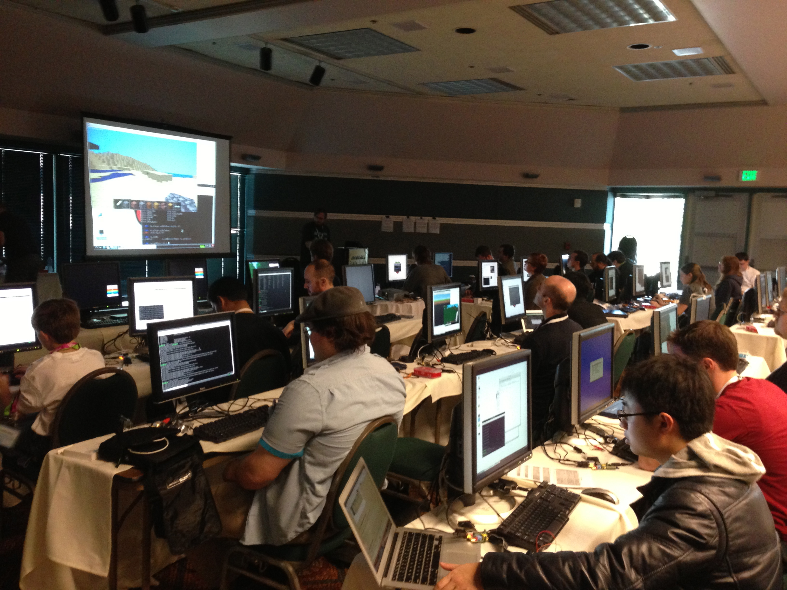

##########
PyCon 2013
##########

:date: 2013-03-12
:tags: Computers, Python

Rather than head for the beach during Spring break I am off to Santa Clara for
`PyCon 2013 <https://us.pycon.org/2013/>`_. This conference is an annual
gathering of Python geeks, and an opportunity to see what the developers around
the world are doing with our favorite language.  I have not spent time in
Silicon Valley for many years, so this is a neat opportunity to visit old
haunts and stop by a few places I like. The conference itself is in the Santa
Clara Convention Center.

So, westward-ho!

When I got to the airport in San Francisco, I picked up my shiny new Toyota
Prius rental car. OMG, anyone ever driven one of these. With no guidance, I sat
down and stared at the dash. No place for a key, only a push button labeled
"Start".  Except pushing that did nothing but light up the dash. After staring
at that for a moment, I noticed directions to step on the brake before the car
would start. Pressing on the brake and pushing the "Start" button was met with
more lights and absolutely no clue that the car had started. Then I got to
explore the gear shift, which is kind of funny as well, since it is basically
just a toggle switch. Once I figured out how to get it into reverse, I pushed
down on the accelerator, and the car silently backed out of the space. Well,
actually there was a dump-truck-backing-up beep going on as it moved, but it
did move. More fiddling with the gear shift got it in drive and it went
forward. It is weird, and probably would have been worth a few seconds
training. The girl at the check out booth admitted that most folks who rent
these things spend about 10 extra minutes figuring out things. 

Then there is the issue of stopping the silly thing. Easy, press "Start" again
and it all shuts down. Oh yeah, the key? Well there is no key, just a security
fob that you use to lock and unlock the car. Later in the trip, my nephew and I
experimented with trying to start the unlocked car without having the key fob
in the car. As should be expected, the fob must be detected to start the thing
up. Ain't technology grand! It does get great gas mileage!

The conference itself was split into two major sections. First, there were
several dozen tutorials offered up on a wide variety of topics. I have been
working with *Django* as a web application platform for some time, and decided
to sit through two tutorials on this platform:

* `Effective Django <https://us.pycon.org/2013/schedule/presentation/9/>`_
* `Fully Test-Driven Web Development with Django and Selenium <https://us.pycon.org/2013/schedule/presentation/10/>`_

In both of these tutorials, we started off with a basic Python setup, installed
a few tools and built a full application from scratch in a matter of minutes.
It is nice to see how other developers set up projects and manage the
development process. I especially enjoyed working through the test-driven
tutorial, since I am working with this technique in a lot of my own
development, and want to move TDD into the teaching I do at ACC.

The last tutoril I attended was a step into high-performance computing. 

* `Applied Parallel Computing with Python <https://us.pycon.org/2013/schedule/presentation/27/>`_

While you might not expect to see Python used in high-performance applications,
it is quite common to manage data processing with a layer of Python code, do
the number crunching in a C++ application, then post-process the results again
using Python tools. We got a chance to do real parallel processing in pure
Python, which was very interesting. The demonstration examples were simple, but
did push my laptop about as hard as any code I have run on it to date! (The fan
got a good workout!)

This last tutorial was set up in a virtual machine, delivered to attendees
fully configured for the tutorial. As it turned out, the conference wireless
was not up to having several thousand conference attendees all downloading
multi-gigabyte data sets, so most presenters brought a set of USB drives with
the software set up, and we passed these around to get going. It only took a
few minutes and worked pretty well.

There were quite a few tutorials and conference presentations that focused on
using Python in education. More and more schools are using Python as a first
language, and looking at how they did things was interesting. Many are sticking
with basic command-line tools to get students going, but some are using tools
that are available at no cost (or low cost) to students. I own a professional
copy of WingIDE, which was one of the top development tools for Python for many
years. Lately, other tools are becoming popular. During one of the Django
tutorials, the fellow next to me was working with PyCharm and I watched as he
got a basic application set up and running in seconds, then was able to run
tests and debug the code all from inside that tool. It was interesting enough
that ($29 later) I had an educator's copy on my laptop. (I did email a photo of
my ACC ID card to qualify for that price, but iPhones seem to have cameras in
them. Guess that is why!

Like any good development tool, this one takes learning, and I am playing with
it to see if I like it enough to switch tools.

The conference itself was a three day set of talks on a variety of special
topics. Some were general, about the language and how it is evolving, others
were specific to development areas. I sat through several talks on web
development techniques, and came away with a ton of new ideas on how some of my
own work might evolve. The trend in a lot of development is to push the user
interface to mobile platforms like tablets and smart phones, and let the
application core code run on a cloud server someplace. Where is the desktop in
all of this? Well many developers set up their desktops so they can write code
for both sides of the application and test them on the desktop. (There are
simulators for many mobile devices around). It seems clear that we will be
doing more work in this kind of environment as more applications are developed
and network access improves. (Again, some of the demonstrations were limited by
the network available at the conference site)

One lab setup that was very busy during the conference was the `Raspberry-Pi
<http://www.raspberrypi.org/>`_ kids lab:

..  image:: RaspberryPi.jpg
    :alt: Raspberry Pi
    :align: center
    :width: 500

In case you have not heard of this project, the `Raspberry Pi` card was developed
by a couple of geeks who  wanted to use the Arm processor and build a cheap
card that supported networking, hi resolution video, and USB devices. The
original board was sold for $25 and thee first run of 10,000 cards sold out in
30 minutes. 

This place was packed most of the time, with kids! 

They handed our a kit with
the processor, cables needed to hook up a monitor and keyboard, and an SD card
with Linux and Python installed. In some sessions, they had kids writing simple
Python programs in a matter of minutes, then they used game engines developed
for this platform to build parts of real games. The kids were engaged, and with
help from a bunch of volunteers, many of them got some neat example runnings.
Total cost to get a setup running is les than $100 as long as you have an
available monitor and keyboard. They even gave away some of these Pi-cards free
to conference attendees.

PyCon also had vendor displays where I talked to several companies about their
software and its suitability as a tool in the classroom. One group from
`Enthought <http://www.enthought.com>`_ which is based in Austin, has a number
of nest tools they want to push into the classroom. They will be hosting `SciPy
2013 <http://conference.scipy.org/scipy2013/>`_ in Austin in June. 

The conference was great, and hanging out with geeks from all over was a lot of
fun. The Python community is a friendly bunch, and they seem engaged in just
about everything. I did find it interesting that the ratio of PC to Mac laptops
was about 50/50. Developers seem to like the Macs these days.

I managed to get away for an afternoon and visit family in Monterey. We walked
from their home six blocks to the ocean:

This would be a terrible place to have to live! Like my time in Albuquerque,
when you live in vacation-land, where do you go on vacation?

Will I go back next year. I hope to be able to do so, we will see!

