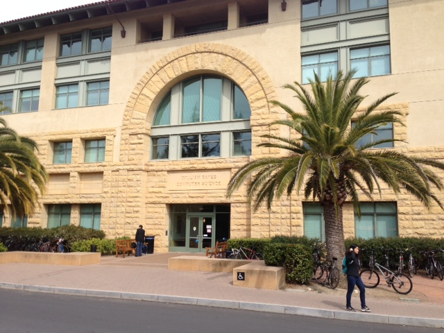

################
Touring Stanford
################

:date: 2013-03-15
:tags: Education, Computers 

I am addicted to exploring universities as part of my travels. Today, I found
myself driving around Campus Loop Drive at Stanford. Finding parking at a
university is always a challenge, but I eventually found a parking garage with
permit machines that took credit cards. So after dropping the car off, I struck
out across campus using my iPhone and the aerial view of the campus as a guide.
BIG MISTAKE! Navigating a place like Stanford, which is huge, on foot using
just the iPhone map tool is not pleasant. Eventually, I found the heart of the
campus, The famous tower:

Supposedly, keeping this tower in view helps keep your bearings. Well that is
true if the line of sight is not blocked by building and trees, so it did not
work so well. With a little effort, I did find the Stanford Bookstore, another
favorite stop on my tours.

Unfortunately, like many university bookstores, the stock of books was pretty
weak. It seems that everything is going digital, and bookstores cannot afford
to stock more books than needed, so the shelves were pretty bare. I have seen
better collections at community college bookstores! Oh, well, I did get to look
at all the Stanford running gear, and other clothing work by most students, it seems.

Here is the view from the bookstore across campus

After studying a physical campus map, I managed to find the William Gates Computer
Science building, home of Computer Science. 

The place was pretty busy with many visitors there for a CS PhD program
orientation. It was nice to see so many folks pursuing that degree, and
Stanford ranks pretty high in the top CS departments.

I did seek out one faculty office while there, but did not get a chance to say
hello to the resident of that office.

Donald Knuth, one of the best Computer Science educators this country has
produced is an Emeritus Professor of Computer Science at Stanford, and has a
permanent office there. 

    
I have long been a fan of his writings, programs, and concepts, so I really had
hoped he might be sitting in his office and I could get a chance to say thanks
for what he has contributed to my meager efforts in Computer Science, but,
alas, he was not around.

If you claim to be a computer professional, one of the indicators is ownership
of Knuth's "The Art of Computer Science". This set of three volumes is a
classic in the field, and I have the original set which I acquired while
teaching at AFIT back in the early 1980's. I have also been a user of his TeX
typesetting software system since about that time as well, and also own volumes
Knuth wrote on that software tool set.

One idea Knuth came up with log ago that stuck with me all those years was his
notion that software should be written as literature, explaining what is going
on to a human reader who must use of maintain that software. Knuth called this
concept "Literate Programming", and I ran across his writing on the subject
about the time I stopped teaching for the Air Force in 1983. I have been
working on a tool of my own that is based on Knuth's ideas and own the
``pylit.org`` and ``co-pylit.org`` domains to support this research effort. I
really want to complete work on this tools set soon, since i believe it has
merit and would be of use to the programming community. I would have loved to
have had a chance to chat about that with Knuth, but that did not happen today.
Oh well, maybe later I can pull that off. I will add it to my bucket list.

Stanford is a school I would have loved to have attended. I often wonder how I
would have done at a "harder" school, and I still have dreams of getting that
PhD finished sometime. Maybe it will happen. You should never stop dreaming,
even in the face of extreme hardships! 
