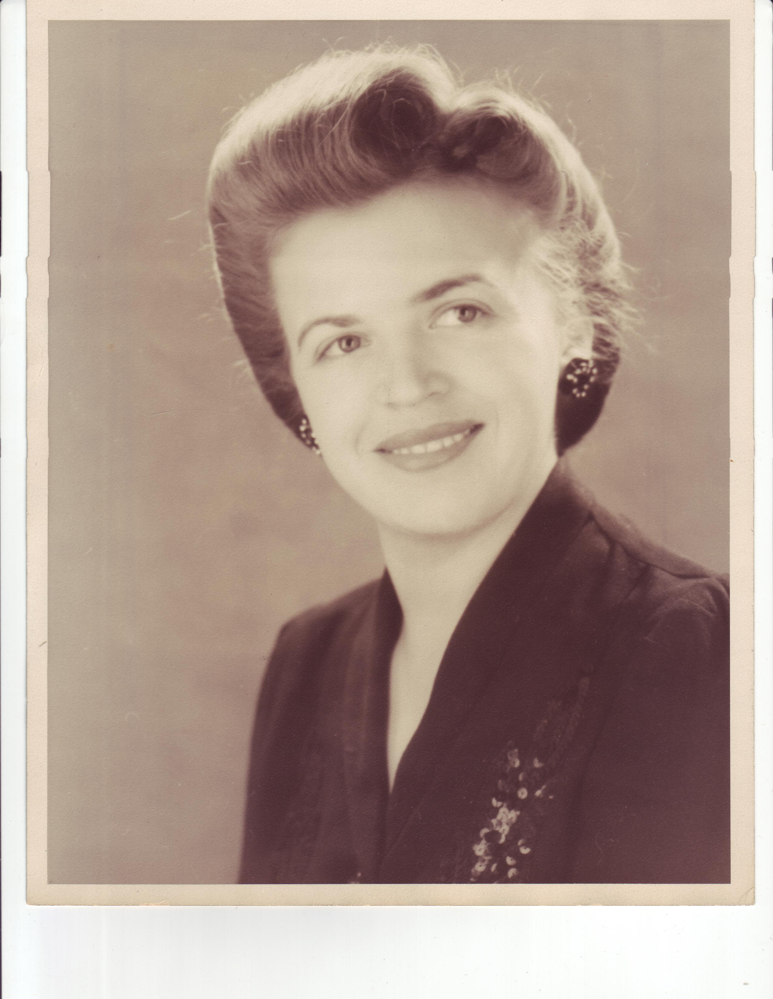
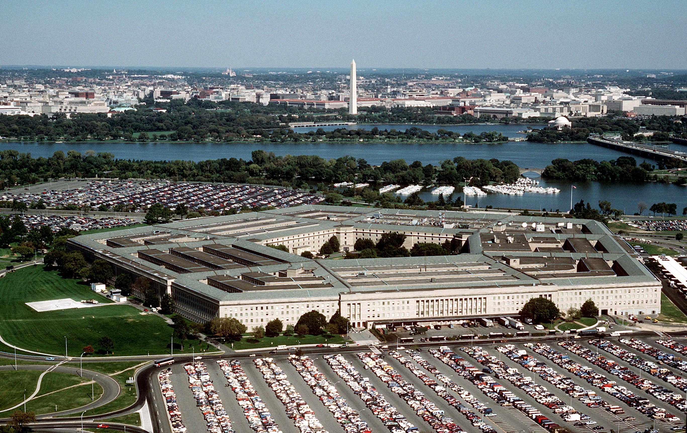
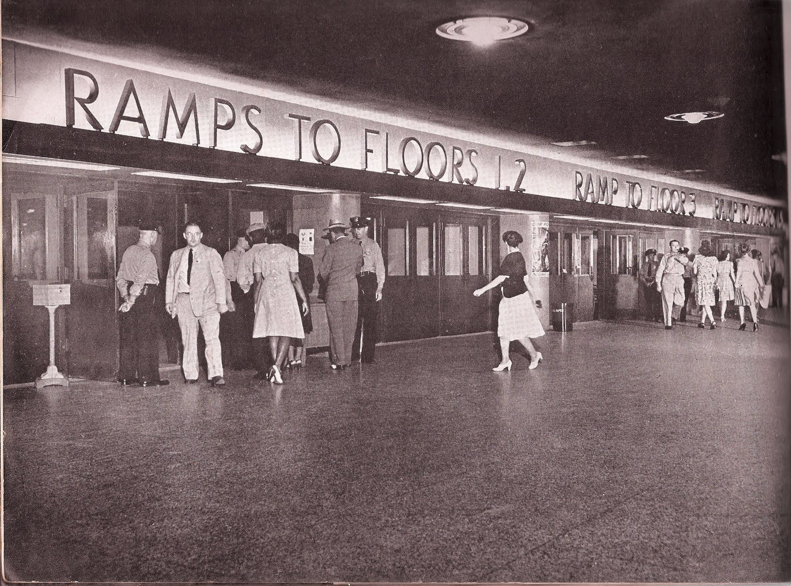
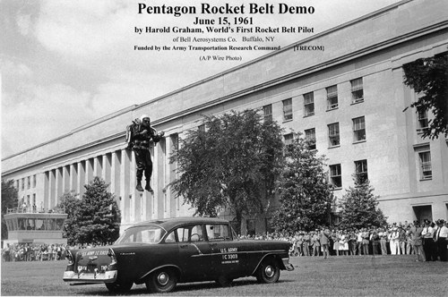
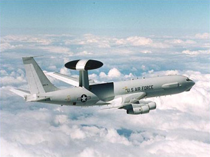
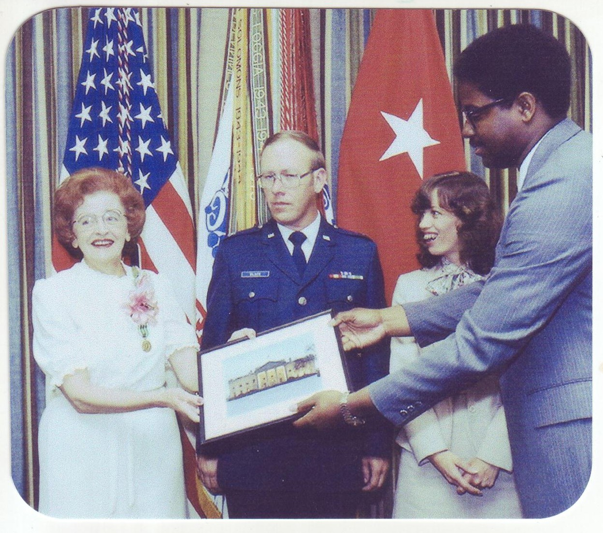
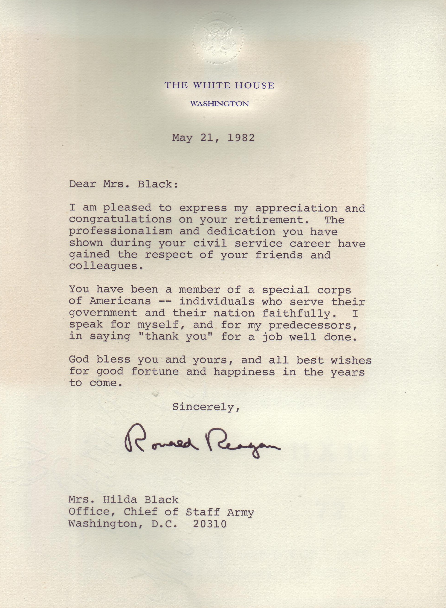

#############
Pentagon Brat
#############

:date: 2013-03-27
:tags: Stories, Veterans

I tell folks I grew up in the Pentagon, and it is true. I spent so much time in
that building as a kid, I probably know it better than some who work there,
even today.  Of course, you cannot explore that building any more. 9/11 put a
stop to all that. Still it was fun being a Pentagon brat!

*******************************
The farm girl from North Dakota
*******************************

My mom was an amazing woman. She grew up in a town of 100 folks in Towner,
North Dakota. She was the daughter of a Norwegian Farm family who moved to
America back in the late 1800's. They settled in North Dakota, since the
weather there was similar to their old homes in Norway (cold!) My mom graduated
from a tiny high school just before Pearl Harbor, and decided to move to
Washington, D.C after the War Department put out a call for help in running the
war we were just getting into. So, she jumped on a bus, got an apartment on the
east side of the Capital, and got a job with the War Department in old
buildings along Independence Ave. Talk about culture shock. From a town of 100
to the big city in a matter of days! A few years later her sister did the same
thing, and the two of then spent time exploring this big new world.

In 1942, everyone in my mom's office moved into a new office building, the
Pentagon. My mom moved in as one of the first groups to be assigned there. She
moved in the day the building opened.

This view shows the old Heliport on the left side, which is where the airliner
hit the building on 9/11. Fortunately, my mom was not with us to see that
event. It would have broken her heart!  She was working there when I came along
in 1946, although she did take some time off to get me going in life. When she
returned to work, I was just about old enough to begin wandering around the
city on the bus, or on foot. I am pretty sure she had no idea how far I was
capable of wandering as a kid, back then.

I remember going to the Pentagon with her many times. I learned the
numbering system that helped you navigate around the building, and would often
wander the halls by myself. (Let's see 3D-361: third floor, D ring, corridor
3, room 61. Simple!) 

I used to envy the people delivering mail in that building. They got to ride
three-wheeled bicycles around, and there were ramps between floors. Boy, that
looked like fun!. We rode the bus to the building, and in the old days, the
busses entered a long tunnel along the south-east side of the building. When you
entered the tunnel, your view of the outside world ended. From that point on,
it was possible to spend the entire day never seeing outside the building,
until you left at the end of the day. As my mom moved up in position, she got
neater offices, eventually even an office on the outside wall. She had an office
on the same wall the airliner hit. I remember sitting in the window watching
helicopters take off and land on the heliport. Great fun for a kid.

The Pentagon had a Concourse, with a bunch of stores. This was a Mall, long
before anyone even thought of a Mall. Stairs from the bus tunnel went right up
to the Concourse, so it was the first thing you saw inside the building. There
were book stores, clothing stores, a post office, and a few barber shops. All
kinds of fun places to explore. Once the manager in a department store there
put a display of silver dollars in the store window with a sign that offered
then up for 75 cents, each. He wanted to see if anyone was looking at his
displays, and not one soul tried to take him up on the deal. There were
cafeterias around as well, so you could spend all your time there doing many
things. Oh, yeah, you were supposed to work, but not me!

One of the neatest places to eat was a stand in the center courtyard. We had
lunch there sitting at tables enjoying the view straight up. Occasionally an
airplane would fly over. Otherwise, nothing. Once early in the history of the
Pentagon. An airplane manufacturer wanted to prove the agility of his small
single seat plane, and he managed to land in that courtyard. I really thought
that was something I should do as well. (Try Googling that story, and guess
what you get back today!)

Once in a while I would walk from Falls Church to the Pentagon and surprise my
mom by walking into her office. It was a surprise, that was about an 8 mile
walk! I would visit, then leave the building and walk over to National Airport
(Now Reagan International Airport) to watch airplanes for a while, then return
to the Pentagon and ride the bus home with my mom.

Wow, the things I got away with back then! A kid trying anything like that
today would never be seen again. The world has changed, not necessarily for the
better.

My mom had a few quirks. One of them was not trusting anything like direct
deposit of her paycheck. She would get her check at her desk, then take it to
one of the banks in the Pentagon and cash it. She then would carry the money to
another bank and deposit it in her account there. Why she did this must have
been a small town thing.  She said she liked holding the cash in her hands,
since she was sure it was hers. 

What us kids liked was the fact that she got money fresh from the Bureau of
Engraving and Printing, right across the Potomac from the Pentagon. Sequential
bills, fresh off the printing press. She would give us a bill, and sometimes we
would get two stuck together. Did we tell her? No way! Once we had it in our
hands, it was ours! Just like she taught us! 

Not that we got that much that way. Her starting salary working in the War
Department was $1400 per year! That was a pretty good salary back then.
Especially for a kid fresh out of high school. Still, after she married my dad,
and my sisters came along, our family managed to survive on her income. My dad
was mostly unemployed as I grew up.

*******************
Wandering the rings
*******************

The Pentagon was a cool place to hang out. Lots of folks in uniform, people
walking around really fast to get from one place to another. I am sure I
inherited my running skills from mom. She walked through that building faster
than I could believe! 

Once, while walking abound the "E" ring (the outer ring) not paying much
attention to where I was going, I noticed that I had wandered into a room with
very nice carpeting. All I can remember about the event was a big Marine in a
fancy uniform grabbing me on the shoulder and telling me "Kid! You cannot be
here!" Seems I had walked right past him into the office of the Chairman of the
Joint Chiefs of Staff. Yep, I was not supposed to be there, and the guard was
probably really annoyed that I had slipped past him.

My mom eventually worked for Army Air Mobility, the office responsible for
acquiring new aircraft for the Army. They used to do demonstrations on the
Heliport, and I got to see several while growing up. I even saw the first
rocket belt demo. I still look for me in this picture. I was over by the tower
building on the left when this part of the demo was going on.

Mom eventually did well enough to be invited to work for the Army Chief of
Staff. Boy that was neat. I never saw so many stars on uniforms as when I
visited her there. I joke today that the reason I had to go into the Air Force
was that I had kicked so many Army Generals in the ankles, they would not let
me in! Actually, the Air Force had cooler airplanes!

She was working for General William Westmoreland, of Viet Nam fame, when I was
commissioned in the USAF. General Westmoreland did the commissioning ceremony
at Virginia Tech, and the joke was they I got to shake his hand before my
mother did. He did not normally interact with his civilian staff, letting his
aides take care of that. (Some folks wonder why he did not do well in politics, after he
retired!) 

One day, my mom was sitting in her office when a very upset man
entered, demanding to see the Chief of Staff. Seems he had tried to enlist in
the Army and had been turned down. My mom spent over an hour trying to calm him
down and explain that he was not going to see the Chief that day. So he sulked
away. A few minutes later, she got a call from the front desk at one of the
main VIP entrances, Seems the guy had parked in reserved parking, and when they
tried to give him a ticket, he started fighting with a couple of Marines. (He
did not win). He tried to claim that my mom had authorized his parking there,
but that did not work out. I know he never got in the Army, and I am pretty
sure the Marines were through with him as well!

Yet another time, she got a call from some woman wanting to report a flying
saucer making off with one of our airplanes, What she had seen was an early
version of one of these, flying over the Washington, D.C. area:

What a wonderful time she was having.

As an Officer in the USAF, I visited this building many times on business. I
had lived in the building for so long, I never really wanted to work there,
although it would have been good for my career!

***************
Retirement time
***************

My mom eventually retired after serving this country for over 31 years. I went
to her retirement in my Air Force uniform, while several Four-Star Generals told stories of
her contributions over the years. Many folks who had worked with her in the
Chief's office during those years later went on to work as military aides in
the White House. So, on her retirement, President Regan sent over a personal note to her, and a signed
picture of the White House, along with a representative to deliver both to her.
Normally, folks got pictures of the Pentagon when they retired. This was a very neat
gesture for the farm girl from North Dakota.

Here is the President's letter:

*****************
The brat grew up!
*****************

I am a real Pentagon brat, one who grew up surrounded by the military, and
listening to those fine folks tell tails of the wars they fought, and the places
they went in support of our national interests. How could I not join their
ranks?

Roie Black, Major, USAF (Retired).

