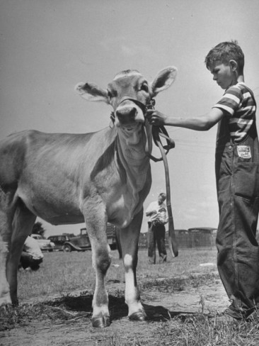
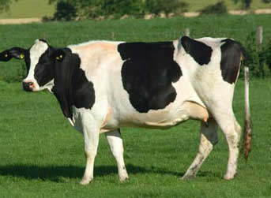
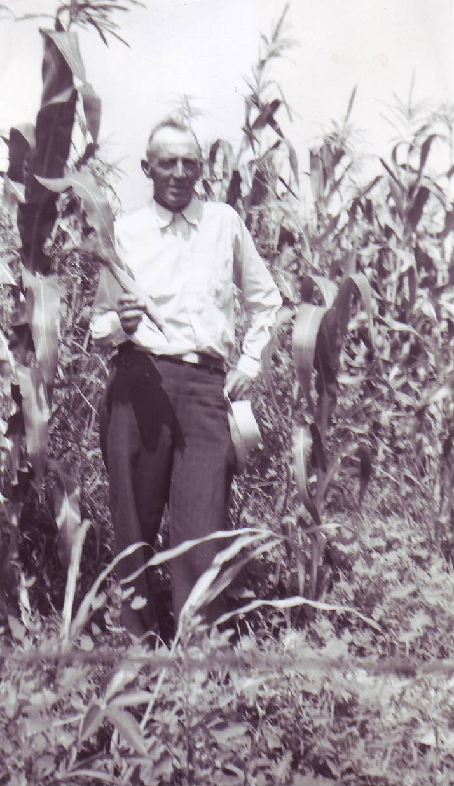
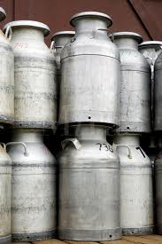

####################
Meeting my first cow
####################

:date: 2013-04-07
:tags: Stories

No, this is not me, but it might have been. I do not have pictures from my
childhood to go with this story. Cameras were hard to come by back then.

I grew up in the city. Actually, I grew up in a small city (Falls Church, VA)
on the edge of a big city (Washington, D.C.). We took field trips to farms, so
I knew what a cow was, but I never got formally introduced to one until my
parents decided I needed to have my world expanded a bit. They wanted me to
meet one of these:

The summer before I started the ninth grade, they sent me to Auroura, Missouri
to spend the entire summer on my Grandfather's milk farm. Grandpa Oscar Larson
owned about 80 acres and milked about 40 cows twice a day to earn a living for
my step-Grandmother, Mary, and himself. He had moved to Missouri after
discovering that it was warmer down south. His parents moved to Towner, North
Dakota from Norway. Towner was where my Mom was born and raised. This is
Grandpa in a corn field back on "NorDak" as we used to call it! 

Here I was, a kid with the ability to wander around the Mall in Washington,
explore the Smithsonian museums, fly model airplanes with my friends, all by
myself. Suddenly, I was standing in a barn with hundreds off cats wandering
around, surrounded by cows everywhere I looked, trying not to step in cow-poo
and wishing I was dead! How can people live like this? No TV, no way to get
anywhere except on foot (not a problem for me, but nowhere to go!)

The worst part? This cow event was to happen at 4 in the morning, and 4 in the
afternoon, and I was supposed to be part of it, every day for the entire
summer! Yuck!

On that first day, Grandpa decided I should learn how to milk a cow.  I had no
clue how to milk a cow, but Grandpa patiently tried to show me how it was done.
This was literally hours after stepping off of an airplane (that part was neat
at least!).  You squeezed just right on this nozzle thing and a stream of hot
milk cam flying out. You were supposed to aim it into a bucket (or into the
mouth of one of those cats) until the bucket was full, then pour the milk into a
large milk can.

I was really bad at milking cows. My hands were not strong enough, I was too
short to reach everything, and when I did things wrong, the stupid cow would
step in the pail, spilling everything all over the place. The cats loved that!,
MY Grandpa, not so much!

My Grandpa's hands were enormous! He had milked cows all his life, and he was
strong. He would grab two of those milk cans and swing them up into the bed of
his truck without even thinking about it. Me? I could barely tip one of them
over (not that I was going to do that, I would have to milk more cows to make
up for it!)

This story is not so much about milking cows, it is more about the things I
learned that summer. It made me a better person!

********************
Living the slow life
********************

Life on the farm moves at a slower pace. I do not believe my Grandpa ever drove
over 35 MPH in his 1949 Chevy pickup truck. I could hardly keep myself still
when other cars would zoom past us on the highway. But when we drove over the
dirt roads to the farm, things were different. Grandpa would drive to the top of
a hill, get this silly grin on his face, and turn the truck off and take it out
of gear. We would coast down the hill reaching astounding speeds (maybe 20 MPH)
then coast up to the top of the next hill. You cannot believe how much fun it
was urging the old Chevy up the hill hoping it would clear the top and we could
do it all again on the next hill. Kids today have no such fun, and they are
missing something. I bonded to my Grandfather more doing silly things like that
than any other time.

Late in the summer, my Mom came out to see what damage I had caused to the
farm. The three of us engaged in this coasting game one day, and all three were
laughing like idiots. We coasted around a corner, and my Mom, who had been
hanging out the side window as we rode, disappeared! She had not closed the
door the right way and it came unlatched. Grandpa and I were shocked by this,
she just vanished! He looked in the rear view mirror to see my Mom picking
herself up off of the dirt road and dust herself off. Moving at 20 MPH is not
so dangerous. She hardly had a scrape on her. It was funny at the time, and
many more times later as the story was retold to everyone in Aurora!

I would ride that truck twice a day into town where Grandpa would deliver his
milk cans, and collect his earnings. We would walk down to the bank and make a
deposit, then head over tho the general store to get whatever supplies we
needed for the farm, or kitchen. 

Grandpa would get out of the truck and toss the keys onto the seat. "Hey,
Grandpa! Aren't you afraid someone will steal your truck" "Nah", he would say,
"If someone needs it they will bring it back. Don't worry much about stealing."

These folks are crazy! They do not live in the real world. Know what? Their
world is the real world. The one I lived in was the mess!

As we rode in the truck, folks actually waved at each other. Trucks would slow
down as they approached, sometimes stopping right in the middle of the road.
Folks would talk to each other! How they got anywhere was a mystery! We waved
at people sitting on their porches, or working in the fields. Everyone knew
everyone else. Nothing like that ever happened in the big city! Sad!

We would walk out of the house to the truck and Grandpa would leave the house
unlocked. "OK, Grandpa, this is really silly, Why do you leave your house
unlocked?" "If someone was walking by and they were hungry, they can stop in
and have a sandwich. What is wrong with that?" "Well, Ummm" I stammered, I
could not give him an answer! There was a strange thing called trust in your
fellow man at work in this farm community. Such a thing did not exist where I
lived!

*********************
Learning how to drive
*********************

I learned how to drive in that silly truck. Grandpa tossed the keys to me and
said I should drive it out into the pasture and take a few bails of hay out to
the cows. Do you have any idea how heavy a bail of hay is? Well, I was not
going to miss a chance to drive the Chevy, so I figured out how to get the hay
into the truck and was off like a shot. Well, actually, it was not quite like
that. This thing had a manual transmission. First, you had to learn that you
could not start it until the clutch pedal was pushed in all the way (neat trick
for a short kid). Then, you had to step on the brake to keep the truck from
rolling backward down the hill as you fumbled with the key trying to get it
started. After several false starts that had the truck lurching forwards since
I did not have the clutch pedal all the way down, I managed to get the beast
started.  Then I had to figure out how to let the clutch out, step on the gas
pedal and let go of the brakes without stalling the stuck.  That took a few
tries.  It did not help that Grandpa was standing next to the truck with his
silly grin shaking his head!

Eventually, I figured it all out and managed to get hay to the cows before they
starved! I do not think I realized it, but I was having a ball! After a while,
I was driving all over the pastures on his farm, exploring every inch and
covering the tires with cow by-products. It was fun aiming the car at a "cow
pie" and seeing if you could hit it. There were plenty of targets!

*********************
Where food comes from
*********************

Most folks these days are pretty squeamish about knowing much about where their
food comes from. Grandpa called me out into the barnyard one morning and handed
a chicken to me. "Hold it down here", he said. Then he whipped out an ax and
chopped off the chicken's head! OMG! I threw the chicken away from me, and it
took off like a shot running across the barnyard. It did not seem to know where
it was going (duh!), and eventually it ran into the side of the barn. Grandpa
was standing there with his silly grin watching me try to cope with this. He
told me I was a wimp, and the next day, he took me to a chicken slaughterhouse
where I got to see how it was done on a large scale. I will not tell that
story, but the images I saw are welded into my brain to this day! All of this
helped me years later when I visited China and had to eat there. Every Chinese
restaurant we went into felt like walking through a pet store as you walked to
the tables in the rear. You were supposed to pick your meal on the way back!
Yuck!

*************************
Using my artistic talents
*************************

When I got bored that summer, I would take out a sketchbook and draw pictures
of life on the farm. I drew pictures of the barn, the house, even the outhouse!
(Yep, had to use one of those all summer!) Grandpa thought those pictures wee
pretty neat, so he had me show them to a few of his friends. Charlie Sulwold,
Grandpa's best friend, was the first to ask me to draw his house, which I did.
(I had to run off his two ornery mules, who were not quite sure what all this
drawing stuff was all about!)

Next up, the minister at the church wanted a picture of his church. I would
draw a picture on a sheet in my sketchbook, then tear it out and give it away.
I have none of those pictures today, but drew dozens of them that summer.

Mike Pfitzner had the farm just north of Grandpas, and we spent quite a lot of
time helping the Pfitzner clan work their hay fields. His son, Mike, (how did
they keep all this straight?) and I became good friends that summer. Mr.
Pfitzner wanted a picture of his house, so I drew one for him as well. It was a
great way to meet more folks, and experience more of life in the farmlands.

All in all, my summer was such a wonderful experience I never forgot those
folks, how they lived, and the values they all shared. 

*******************
Revisiting the farm
*******************

Years later, long after my Grandpa (and Mary) had pasted on, I revisited Aurora
and drove around the town. After asking a few folks, I found Mr. Pfitzner
living alone in a small house in town. His sons had grown up and were working
farms of their own. Mike Junior bought my Grandpa's farm when he decided it was
time to retire. Mike senior had retired after his wife had died, and was living
alone now. I walked up to his front door and knocked. An old man using a walker
came up to the door, stared at me for a moment, and finally exclaimed "Roie
Robert!" (For some reason, that was what my Grandpa had called me all the
time). I could not believe he recognized me, but he did, and he invited me into
his parlor. After we had been sitting there talking for a while, he got up and
said, "Wait there a minute". He left the room and after a short time, returned
holding a picture frame. It was the drawing I had done of his house that
summer. He told me they had it framed, and it occupied a place of honor on the
mantle above the fireplace in that farm house for many years. Every time
visitors can into the house, Mike would take the picture down and pass it
around. I was never more moved in my life. My simple picture became a family
heirloom, and he cherished that piece of paper. He told me he was giving it to
his son, Mike, when he passed on himself.

I asked about Charile Sulwold as well, and found out he was in a nursing home
outside of town. I had to go visit him as well. Charlie was in much poorer
shape. He was sitting alone on his bed in a small room that was his world. Once
again, I knocked on his door, and he turned and stared at me as well. Again, it
took a few moments, but Charlie recognized me as well. We spent a few hours
retelling tales of my summer, my Grandpa, and the fine folks from that world in
Missouri.

***************
What you missed
***************

If you grew up in the "big city" you missed something. Far too many folks today
look down on the farmers and their families, but they built this land. At least
they fed it as it was being built! Their lives are hard, but simple. They love
what they do, and love the folks around them. Sit in a church in such a
community, and you are instantly drawn in like you had lived there your entire
life. That summer was special in my life.

I returned to Falls Church and the big city at the end of that summer. I had
missed the Beatles taking over the world, but caught up in short order, and
went back to my life in that "real world" (Real messed up world!) I never
forgot the folks I had met, the tales we told, the hard work, the smell of the
cows (yuk), the shared meals with families from all over sitting under a tree
after working all day in a field. It was a special time.

I could never live such a life, I am too drawn by the technology we build to
make this world a more interesting place. Is it better, I am not so sure. I
respect the folks who still live on the farms. My family came from such stock.
Their values are the ones I hope I have kept close as I have lived my somewhat
more chaotic life.

