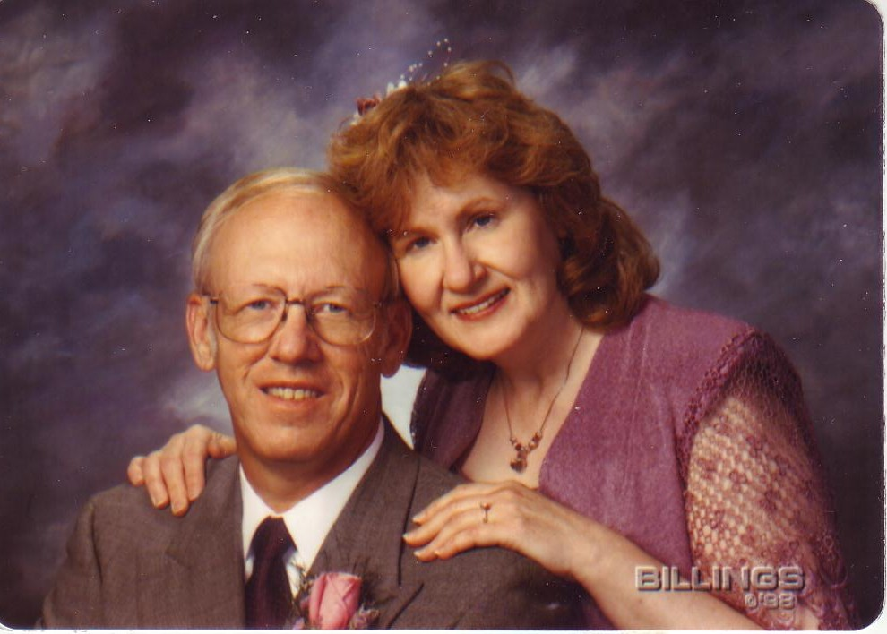

###########
Connections
###########

:date: 2013-04-15
:tags: Stories

Are you connected with anyone else in your world? I am proud to say I am, to
this wonderful woman:

Chery and I have been together for almost 15 years. I wish I had met her
earlier when our paths did cross many years ago.

..  note::

    I have to note that today would have been my father's birthday. He was an
    accountant, and was born on "tax day". Seems appropriate!

We go to `Gateway Community Church <http://www.gatewaychurch.com>`_ in Austin.
This is a non-denominational church founded by John Burke to help those folks
who are lost in this world find connections with others in this community, and
with God. We want anyone to come and join us; believers, non-believers, anyone
is welcome to explore their beliefs in this group. We have been a part of this
church as it has grown over the last decade into a wonderful place where we are
all making many "connections" MY wife is on the Board of Directors, and I am
proud of her work in that role.

This message is not going to tell you you have to believe in God, that is up to
you. You do need to know one very important thing.

*************************************************
We were meant to live our lives with other people
*************************************************

We were not meant to live our lives alone. We were meant to be "connected" with
others. We all share our lives with others, whether we set out to do so
intentionally, or not. We interact with others all the time. But are you
really connected?

The geeks view of connections
=============================

I teach about small computers in my work as a Professor of Computer Science
here in Austin. In part of one of my classes, we work with really small
computers, designed to be buried into all kinds of things: cars, phones, even
toys. These computers are built in such a way that they have a number of
"connection" pins where they are hooked up with motors, light sensors,
temperature probes, display lights, all kinds of things. Each connection has an
interesting property. We can program the connection to be an "input"
connection, or we can program it to be an "output" connection. It cannot do
both at the same time, but we can switch gears when we want.

I started thinking about human connections the other day, and it struck me that
people seem to do the same thing. When we "connect" with others, we program the
connection to be either an "input" or an "output"

Input connections
=================

You know what these are. You need to get your car fixed, so you go to the car
dealer's service center and walk up to your support person. You establish an
"input" connection where you are seeking help from that person for your
problem. You want that person at the other end of your connection to listen to
your concerns, and do something for you. You probably have no thought about
helping them in any real way. At the moment, you are in "input" mode! You hope
the support person is in "output" mode! 

Nothing wrong with that, we need such a connection when we need help.

Output connections
==================

On the other hand, as an educator, I establish connections with my students all
the time. When we begin a new class, my connection with each student is
definitely an "output" connection. I want to help them learn a new skill, one I
hope will help them live a fascinating life. I have been there, and done that,
and I want them to have the same success I had, and just as much fun. 

You could argue that after the class starts, I switch modes and change my
connections with my students into an "input" connection as I ask them to turn
in lab assignments and take tests. Such is life. That is how we teach in this
word, these days. It looks like real human connections always switch modes as
they evolve. 

I am sure some will think I am over simplifying this idea way too much. Hey,
these are my thoughts - some good, some not so good.

*********************************************
Are you an input person, or an output person?
*********************************************

Why I started thinking about all this really goes back to my thinking about how
I have lived my life so far. I started off a shy kid, afraid of establishing
connections with others (especially girls) and ended up spending a lot of time
on my own. I explored the Washington, D.C. area and learned a bunch on my own.
I thought I was happy, but I was missing something. Except for a few close
friends who shared my passion for aviation, I had few connections back them.

However, as I grew up, I was surrounded by a group of people who were
definitely "output" people. With no thought about getting anything back, they
dedicated their lives to giving to others, sometimes giving up their lives to
help others. My parents generation went to war. They went to a war few growing
up today can even comprehend. There were people in this world back then (and
even today, I am afraid) who would do anything to get what they wanted, even
destroy entire cultures if needed. My "output" people dedicated their lives to
stopping them. I was impressed. I also saw how important it was that such
people exist in this world. I set out to become one.

Look at my choices in life. I set out to learn how to build flying vehicles to
transport my fellow man to places they wanted to go. I joined the USAF to help
protect my fellow man from the absolute crazy people still out there, even
after we won that war. Along the way, I discovered that I was pretty good as an
educator, so I set out to become a professor, who could help others learn the
skills they need to live fulfilling lives.

I am definitely an "output" person by nature, and I like that!

I never made any choice based on what it would get me. I did it because I
thought it would benefit others. I never chased the dollar, but it followed me
well enough. I am happy with my choices (well, most of them. I have screwed up
more times than I like to admit!)

I am convinced that we tend to hang out with people who share your basic
beliefs. Early on in our relationship (another term for a close connection),
Cheryl told me she was worried that she might not make a difference in this
world. Definitely the thoughts of an "output" person! I set out to push her a
bit, to show her what she could do to really make a difference. I could see
that she had it in her to really do well, she was just a bit shy about doing
so. Know what? It worked. She is a highly respected person in this town,
dedicated to helping others. What is cool is that her focus is on the
non-profit world. Wow! More "output" people helping others. This is too cool!

Problems in this world
======================

I am convinced that many of the problems we see in this world come because
too many of us spend most of our time programmed in "input" mode. We want stuff!
(I like stuff, Cheryl will tell you I am surrounded by it!). What I mean is that
these folks seldom think about how their lives will benefit others, they are
more concerned with what it will do for them! I worry about those folks a
lot. They are missing out on real satisfaction in their lives.

(How many times do you hear people gloat about how many "friends" they have on
Facebook? Are any of those "connections" ones you can really be proud of?
Unfortunately, most of folks "friends" are not people they can even name.)

***********************
Switching to input mode
***********************

Since I spend so much of my time in "output" mode, it is hard for me to switch
sometimes.

Right now (tomorrow, in fact), I will enter the hospital to begin another
battle with cancer. I will be surrounded by people in "output" mode. People who
are dedicated to saving my life. I trust them all, and am grateful for how they
have lived their lives, and how dedicated they are to their professions. 

I am also surrounded by an incredible support system, full of hundreds of folks
who are wishing Cheryl and I well. Thoughts and prayers are coming in from
everywhere! It is humbling to discover how many connections I actually have.
All of them are in "output" mode, thinking about me and my upcoming surgery,
worrying about Cheryl. I have trouble accepting all this support, but I am
coping!

Cheryl to the rescue
====================

My wonderful wife is helping me through all this. She has taken over making
sure all the folks in my support system are kept informed at every step of the
way. Me? I will be out of it. On drugs, sleeping, hoping for the best.

More help is on the way, as well
================================

Some of my support is coming from surprising places. I graduated from high
school almost 50 years ago. As a result of this blog, one of those girls I was
terrified of back in school stumbled on my blog and asked if she could let others
in our class look at it. I was very happy to let that happen, and it opened up a
flood of messages from folks who helped shape my life all those year ago. This
is amazing. (Judy, I thank you for that!) It also brought back many old
memories that have been the basis for a few of my postings.

************************
Thanking my support team
************************

Before closing, I want to say a special thanks to some of the support folks who
have made this unexpected journey much more bearable. If you are in my support
system and not listed, please know that I am especially grateful for each of
you! You all matter to me, and I do not mean to slight any of you.

(Hmmm, if you feel slighted, you need to reprogram to "output" mode, that is
"input" mode at work!)

Each of these folks are definitely "output" people.

Family
======

    * Cheryl - without doubt, the most important connection in my life. 
    * Connie, and Karen (my sisters) - who will be here to help me through radiation
    * Bill - Cousin from Wyoming, coming down to be with Cheryl during the first few weeks
    * all the other family members who have prayed, emailed, and called with their support

Friends
=======

    * Jim Petty - my best friend for almost 40 years

Church
======

    * John Burke - he grabbed Cheryl and I on the walk after he gave the Easter sermon to pray for us
    * Eric Bryant - South Campus Pastor, and friend. 

Work
====

    * Mary Kohls - My boss, who managed to get me unhooked from this semester
      so I can concentrate on healing.

My High School chums
====================

    * Judy Ingalls Hughes - Who helped my classmates find out what was going
      on, and generated a ton of unexpected support. 

All the others
==============

Believe me, there is a huge list if folks who are out there supporting my wife
and I in all this. You are all special in out hearts. Thanks is such a small
word for what we feel for all of you.

**********
God's love
**********

I do believe in God. It took a while for my engineer's brain to come to terms
with this. But I have. I feel His presence in this upcoming trial. I am praying
that He helps all those around me get through this as well. 

Thanks to all who have been in touch with me as we get ready for tomorrow.
Cheryl and I are ready, and we are confident that with all your support, and
with Gods love, it will turn out just fine.

I will post more after the surgery, when they give me my techno-toys back!

I love you all, and I thank you from my heart.

Roie Black (Humble "output" person!)

