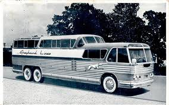

####################################
Now Arriving:The 6:15 from Sheboygan
####################################

:date: 2013-04-26
:tags: Cancer

..  note::

    I really had no idea where Sheboygan was (Wisconsin) until I looked it up.
    I just remembered sitting in the Greyhound Bus Station in Washington, D.C.,
    waiting for the bus to take me back to Virginia Tech, and hearing
    announcements like that.  It just sounded cool!

Well, my doctor told me it was going to feel like I got hit by a bus, but he
neglected to tell me that that bus was going to hit me, then sit on top of me
for a while. Suffice it to say, I am still in the hospital recovering to a
point where I can go home and recover more. 

***********
The surgery
***********

..  warning::

    Don't worry, I will keep this readable, even if you are squeamish about
    such things! If you are worried, skip this section. I write this to help
    those who might have to experience it themselves, or help a loved one get
    through the process.

I checked in on April 16 at 5:45am and was immediately taken back into pre-op
to get ready for the adventure. That process involves filling out a bunch of
forms, a few needles (yuck!), and sitting around thinking about that is coming.
I have said this before, and I will say it again. If you have faith in your
care team, which is made up of your family, friends, doctors, and anyone else
who cares about you (I do), and God (I do), then the sitting around part was
not so bad. I have been here before, and survived just fine. 

About 6:15, they rolled me down the hall into the operating room (why is
everyone but me wearing a mask?) and getting me ready. I remember my doctor
walking up and talking to me, and I remember him saying he was going to start
the tracheotomy, which I needed since they were going to be doing a bunch of
work in my mouth, and I had a limited ability to open it due to the radiation
treatments I had five years ago. Before the surgery, my doctor told me that
most folks do not remember any of this. (Sorry, Doc! I remember it all!) He got
that started, and...

Boom
====

The bus rolled into the room, I was out like a light, and remember nothing
until I find myself waking up in a recovery area with a gazillion tubes and
wires poking out of me! It was 11 hours later! Yikes!

Step one: get rid of the bad stuff
==================================

My primary surgeon spent about 6 hours of that seeking out the cancer and
removing it as best he could. He did all that under a microscope, and the
process is tedious. He removed the obvious cancerous tissue, and as he got
closer to the edge, he was hunting down feather-like structures, cutting them
out, freezing them and sending them to the lab for testing. When he had the
total area around the tumor removed, and the tests are coming back negative for
cancer, he declared the process over. There may still be cancer cells around,
but we will blow them away with the radiation treatment that will come in a
month or two, when I am strong enough.

Step two: Make it look better
=============================

Following all that, my plastic surgeon took over and proceeded to fill in the
areas damaged by the initial process. I lost a few more teeth, a bit more skin
and bone in my cheek and upper jawbone, and have a bigger hole in the roof of
my mouth, now. So he "borrowed" some skin, fat tissue, and supporting blood
supply parts and moves them into the affected areas. Wow, just like renovating
a house! (Hey, wait a minute! Is he going to put things back later? I hope not!)

Butt-face
---------

I have to tell you, my grandson is not happy. He was hoping that the doctor
would take skin from a particular area of my body for this process and move it
to my face so he could call me "butt-face". Sorry, Colin, it came from my upper
thigh. (He is five. We all had a good laugh over this turn of events!)

Becoming a Cyborg
-----------------

The interesting part of the plastic surgery process is the instrumentation
they do to make sure the grafted tissue survives in the new location.
Obviously, good blood supply is required, so they attached a blood flow and
oxygen level monitoring system that closely watches the graft If anythings goes
bad, they can jump in and redo things, hopefully without needing any new
tissue.

I ended up with a bunch of wires coming from the new skin around my cheek, and
some cool LED lights that lit up as the monitoring system did its thing. At
night, I looked a bit like a cyborg! Cool!

**************
On to recovery
**************

After waking up from all this, they moved me to Intensive-Care. I needed to be
monitored on several levels to make sure things were working properly.
Initially, I was in no shape to move much, but was in little pain, and
everything seemed to work, at least reasonably well. There is some nerve
damage, and a ton of swelling in the area of the skin grafts, but all that was
pretty manageable. 

Angels
======

Know any nurses? Well, I have to tell you, they are angels, without doubt. When
you can do little to care for yourself, they come charging in to help you in
ways you cannot imagine until you experience them. The nurses I had in the ICU
were outstanding, enough so that we nominated several for in-house awards. The
attention they gave me to take care of my pain level, to keep me clean and
comfortable as I lay there pretty much unable to move anything, was just
amazing. Their job is tough, and worthy of more respect than they get. They do this
work with not a seconds hesitation. (Sounds like another group of "output" people to
me!)

I stayed in the ICU for almost a full week. I learned how not to eat
(everything went in through a tube). I learned how to go to the bathroom
without getting out of bed (and without getting the sheets wet) but I will not
go into that! Suffice it to say that you just have to give up on modesty when you
are in this kind of situation!

I was pretty happy that the pain level was not so bad. I had major work done on
the side of my face, the inside of my mouth and on my leg, and none of those
areas had major pain. The worst part of the entire situation was the swelling
on my face. (My grandson and I settled on "chipmunk-face" as a suitable
alternative to his first choice).

Keeping Quiet
=============

Anyone who knows me knows I like to talk. Heck, that is part of why I love
teaching! I get to tell stories to a room full of students who are supposed to
listen, and even take notes! Cool!

However, as a result of the tracheotomy, I was unable to speak, so I had to
write. Initially, this was hard, just because I was so weak and wired-up with
tubes and instrumentation wires that I could hardly move, but I managed
to scribble notes to the nurses and my wife. My sense of humor was unleashed
and was an instant hit with the nurses! They actually enjoyed the interactions
we had, enough so that several told me I was their favorite patient. Perhaps
they told all their patients that, to keep their spirits up, but I am going to
believe it anyway!  And, yes, it does make you feel good!

*****************
Intermediate Care
*****************

After everyone was sure there were not going to be any issues with skin grafts
or anything else, they moved me to Intermediate care. In this unit, they still
monitor all the wires and keep close track of you, but not at the intense level
of the ICU. The nurses here were equally nice, all very caring and good at
keeping you comfortable. 

While I was here, they pulled enough tubes out that I could start to get
unhooked from equipment enough to get out of bed. First stop, the "throne" in
the room, which was a huge improvement over the plastic gadgets they were using
in the ICU. My leg was pretty weak where they "borrowed" things, but I had no
real pain when I moved around. Getting up and sitting down required help, but
once again, the angels were there to help!

After a few days, we decided to take a walk. I had to use a walker to steady
myself on the first try, but did manage to get out of the room, walk down the
hall a few rooms worth, and get back without any problems, so every one was
pretty happy!

Next day, we tried the walk again, and I got the swing of things well enough to
ditch the walker after a few feet, and took off on a stroll the length of the
hall (600 feet) and back. Most of the staff in the hall had amazed looks on
their faces, knowing what I had been through. The physical therapist who was
with me fired me on the spot declaring that I did not need their services.
Pretty good progress for two tries! 

The next day, my wife and I did the same stroll together and we were feeing
pretty good about the progress.

********************
Out with the Trache!
********************

Well, at least out with the speech-killing version. One week after my initial
surgery, my doctor decided to downsize the trache tube (the one that goes
from a hole in your throat to your lungs) with a smaller one that would let me
breath better and speak! Only problem, another surgery!

I went through a very similar pre-op process, only this time with fewer forms.
They wheeled me into the operating room and slid me onto the table, then the
lights went out!

As I was wondering what had happened, I realized it was over. Elapsed time?
Eight minutes! Wow! I did not really try to speak then, but after getting over
the sedation drugs and they took me back to my room, I was able to talk if I
made sure I did so while exhaling. It was not a strong voice, but it was
clearer because of the new tissue they had put in my mouth. My voice before
all this was a bit weird because of the way the roof of my mouth was reformed
after my first cancer surgery. It did not help that I had a "defect" which let
air (and spaghetti) move from my mouth to my nose. Ever smelled spaghetti?
Don't try it, it was not fun!

My doctor stopped by later that evening and taught me how to cover the opening
to the trache tube which made all the air move over my vocal chords and my
speech was much more normal

Now, I could do a much better job of joking with the nurses! Hey, you have to
have fun everywhere you are! 

*****************
On to the "floor"
*****************

Nine days after surgery, I was moved to the "Floor", which conjured up all
kinds of prison images until I found out it was just where the normal rooms
are. Now, I am in a very small (and expensive) room with minimal monitoring,
but this is the last step before escaping from the hospital.

The swallow test
================

The big step, now, is to make sure I can swallow well enough to go home and
eat. That turns out to be harder than you might expect. I flunked the first
test because my swallow parts were not strong enough to properly protect my
lungs from whatever you try to swallow. You do not even think about this,
normally.

My swollen face, some nerve damage, and being on the trache for so long all are
working against me. After two days of exercises to improve things, I did
improve, but not well enough to escape this place.

*************
What is next?
*************

I have to pass Swallowing 101 before they will pull out the trache and all the
other tubing and send me home. It looks like I will be here for a few more
days, enjoying basic cable (yucky, yuck!) and working on my swallow techniques.
With any luck, then I will go home and let my face and leg heal. As that
happens, the swelling in the new tissue around my cheek will go down and I will
get to see what it will look like after everything is done. I have not looked
at my new face yet, preferring to wait a bit, but everyone is telling me it
looks good (they lie - that is where "Chipmunk-face came from).  The plastic
surgeon says I will have a two-tone face since my leg has not tanned to the
same level as my face, but exercise and a little Mary Kay will fix that. What
did I say? I might have to use make-up. Yee Gadzooks! Oh, yeah. I doubt that I
will need to shave on that part of my face either.

******************
With all my heart!
******************

I want to thank all those who have tracked my adventure, and been in touch with
my wife through this ordeal. I have been getting a summary of all the emails,
tweets, and phone calls, as I have not been up to emailing. I am obviously able
to get to my computer to write, but this has taken quite a long time to get
written, so I will not be doing this again probably until I get home. 

I am very grateful for all your support, so is Cheryl. We will properly thank
all of you as soon as we can. In the meantime, may you never face the demon
that is cancer. But if you do, I hope my missives help you get through them.

Roie and Cheryl
