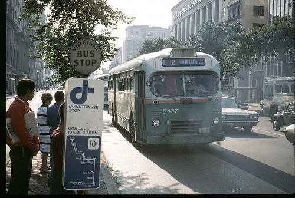
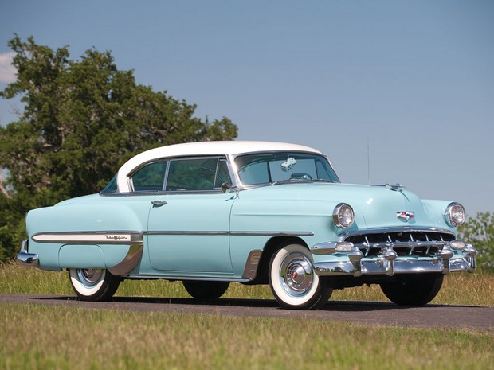
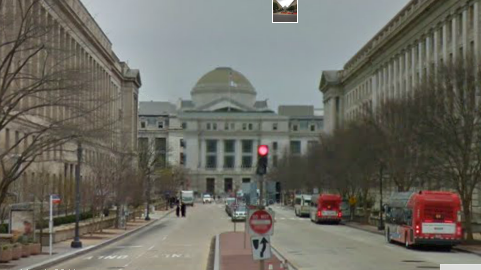

##############
Riding the bus
##############

:date: 2013-05-07
:tags: Stories

Ever ridden a bus? I did for most of my growing up adventures. My family had
cars when I was very young, the last one was a 1954 Chevrolet Bel-Air that I
was supposed to get as my first car. Unfortunately, my dad's drinking
got the best of him and he lost his license to drive well before my 16th
birthday, and the car sat in front of our house with me dreaming of driving it.
Eventually, the city towed it away, along with my dreams. (Oddly, I still have
the keys to that car!).

Around the time I started the fourth grade, my family moved back to Falls
Church, Virginia. We settled in Tyler Gardens, a development with four homes
per building, and several hundred buildings right in the center of town. My mom
could walk up to Broad Street, one of the main routes through Falls
Church, and jump on a bus that took her directly to the Pentagon each day. I
could walk the six blocks to my elementary school, and dad was largely
unemployed, so we never really missed the car that much. Instead, we all
learned how to ride the bus.

*****************************
Earning money to ride the bus
*****************************

I had a paper route, my dad's way of not needing to give me an allowance and
teaching me something about the business world, so I usually had a bit of cash
available for the essentials of youth. You know! Ice Cream from the Good Humor
truck, Cokes from the nickel machine outside the Gas Station up the street,
things like that. It cost 25 cents to jump on the bus and ride to Roslyn where
the line would end and you transferred to a DC bus to get downtown. Eventually,
the Virginia buses were allowed to go all the way to 10th and E streets in DC,
and they bumped the fare to 30 cents if you wanted to do that.

The interesting thing about riding the bus all the way downtown was that it
dropped you off right at the steps to the house where Lincoln died, across the
street from the Ford Theater. I had learned enough history to be interested in
that event, so I usually stuck my nose into the building to check if the sheets
on the bed were clean. Then I would set off down 10th Street to the Smithsonian
Museum of Natural History! 

This view is from Google Maps, isn't it neat to be able to wander around
looking at old haunts?

I did all this by myself, and I suspect my parents knew I ws doing it, but they
never said anything about it. I was all of about 10 years old when I started
doing this. A kid today trying that would never be seen again! Times do change,
not always for the better!

*****************************
Beginning to explore my world
*****************************

Looking at that picture of the view along 10th Street, the building on the left
was the old FBI building, the one on the right was the Internal Revenue Service.
Guess which one I was likely to enter and wander through on my way down the
street! If I timed things right, the FBI had pubic tours of the building that I
could sneak into. The cool thing about that was the last stop, the shooting
range in the basement. They would bring out tommy guns from the prohibition era
and blast away, just like what we were seeing on our first television shows. Way too
cool for a kid like me!

Once I made it to the museum, entering the building took you to an exhibit of
Egyptian artifacts, and a few American Indian displays as well. I would marvel
at the exhibits, especially the ones where they build models of the world those
folks lived in. My interest in building models probably started with those
displays. 

Walking up the stairs took me to the main rotunda. In that space, they
installed the stuffed body of the biggest elephant ever shot, He is still there
today. I would explore this building, especially the Gem Hall which held the
Hope Diamond nd a bunch of cool looking rocks. I tried to get into geology, but
that never quite took off. I do remember there was a quartz crystal ball about a
foot in diameter that was supposed to be "perfect". Of course, I found a bubble
in the middle of it, but the guard was unimpressed when I showed it to him. Who
is going to believe a kid anyway?

After doing my standard tour of the building, I would leave on the Mall side of
the building and walk directly across the Mall to the Smithsonian Castle
building. In that building, they had a bunch of model ships and again, the
detail on the models was incredible. I would dream about building a model of
this caliber if only I could come up with the money to do so!

Finally, I would go to the Arts and Industries Building where the airplanes were
housed. My second dad, Andy Tarapchak, would take me there when I was about
four or so, and I still have memories of those visits. That building was the
most important one in forming my interest in engineering and aviation. 

I did add in the National Art Gallery to ny visits, but that came when my interest in art
surfaced in high school!

***************
Back to the bus
***************

The Smithsonian buildings would close around 5pm, giving me a couple of hours
of time to visit, I would wander back up 10th Street, then walk around the
block to get the bus back home. Waiting for the bus was always cool, there were
shops with cool things like cameras and radios, things I could not afford but
wanted badly, were displayed! If I was lucky, I would beat my mom as she rode
her bus home from work. That is probably why this did not seem like a big deal
to my parents, I was always home by dinner time.

Riding the bus was an adventure as well. The "3F" line that took me downtown
followed Lee Highway from Falls Church to Roslyn and Key Bridge. The DC bus
system had a trolley running from Roslyn across Key Bridge into Georgetown and
into the heart of DC. On good days, I would jump onto the trolley, just for the
fun of it. Otherwise, I had to transfer (until the Virginia buses were allowed
to enter DC) or walk the rest of the way. As a kid, I walked a lot, and I
learned how to walk fast by walking with my mom through the Pentagon. I could
cover some ground if needed, and I had a pretty good sense of direction. As
long as I could see the Washington Monument, there was not much chance of me
getting lost on my way to the Mall. 

*********
Mr. Chase
*********

When I started seventh grade, I moved to George Mason High School, which, oddly
enough, was located in Fairfax County, not Falls Church. It was right on the
city border though. There was a very nice high school, named Falls Church High
School in the center of town, but they discovered that one was too big for the
city, so Falls Church and Fairfax traded schools. 

The city was also too small to invest in school buses, so they contracted
with the WVM Bus Line to provide bus service to the schools. For 10 cents we
could ride the bus the mile or so to school. Occasionally, I would walk, but
other times I rode the bus. These buses were always crowded, so I might walk
the bus route backwards far enough to get a seat.

On the way home from school, I could again ride the bus for 10 cents. But, if I
"forgot" to get off, I could ride all the way downtown. Surprisingly, I found
myself at the Smithsonian many times by forgetting to get off that bus!

Then I met Mr. Chase!

Mr. Chase drove the bus I rode home most of the time. I would try to get a seat
right behind him, and would tell him about my day, and the adventures I was
having. We became good friends over time, and then he did something very cool
for me. He even let me ride his bus for free!

If the bus you were on did not go where you wanted to go, you had to ride to a
transfer stop then change buses. There was no additional fare for this. Instead,
you paid the fare to the end of your trip and got a transfer ticket on the first
bus, and showed that to the next bus driver. The ticket had to be punched with
a code telling the new driver where you were going. Mr. Chase gave me a punch
and a book of tickets and taught me the code. Why he did this, I have no clue,
but it opened up my world like nothing before that. Suddenly, I could ride
buses all over the Virginia, DC, and Maryland area. I would seek out hobby
shops, radio/TV shops, anything cool for a kid to explore and be off on another
adventure. 

I learned my way around that bus system, probably knowing it as well as any of
the drivers. 

I rode the buses around the D.C area until I graduated from George Mason and
left for college in 1964. My exploring days were over. Wait a minute, they just
got started. What I learned about exploring as a kid set me up for exploring
the entire United Stated when I grew up. I drove all over this great country
and eventually flew over a bunch of it when I became a pilot. I am sure I
developed my sense of direction and eagerness to explore all the roads I see
from my days on those buses!

*******************
Revisiting my youth
*******************

When I retired from the Air force in 1993, I went back home to help my mom
through  a surgery that she eventually did not survive. It was not a good time, but I
am glad I was there with her at the end. I stayed in her apartment for several
months, with nothing but a bicycle to get around. Oh, and the buses!

By now the entire bus system in D.C was merged into one big company, the Metro
system. The trolleys were long gone, but in their place was a neat subway
system they started building as I left for college. The old bus lines were still
there, but I only rode them far enough to transfer to the subway. And I was
back in the Smithsonian, revisiting all the exhibits I loved as a kid, and
remembering when!

Not having a car as a kid was not so bad. It was embarrassing not to be able to
have my parents drive me to a friends house, or needing to bum a ride with
friends to get places, but the bus was an important part of my life back then,
and I bet my adventures went beyond those my friends had stuck in their parents
cars!

