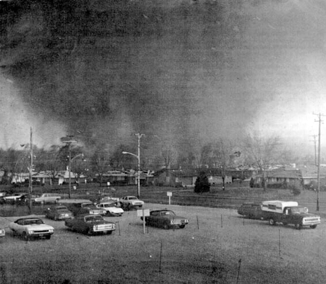
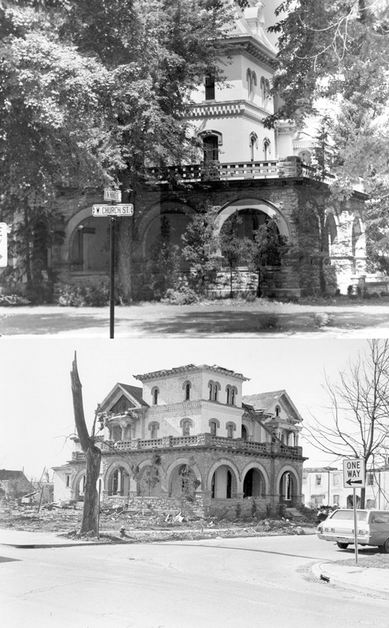

########
Tornados
########

:date: 2013-05-20
:tags: Stories

Sitting around with little to do but heal results in watching a lot of TV, even
when I am working on my laptop doing other things. Obviously, the big news
today is the damage done by a tornado to Moore Oklahoma, a suburb of Oklahoma City.

My good friend, Jim, lives a few miles North of this spot, so I had to check in
with him and make sure he and his wife are OK. They got hit with a hail storm a
few weeks ago that killed the roof on their home, and did not need this at all.
(They are away on a trip back East, so they are OK).

********************
Xenia, April 3, 1974
********************

My first real encounter with a tornado was back in 1974, shortly after I
entered the USAF at Wright-Patterson, AFB near Dayton Ohio. I was in the middle
of getting my pilot's license at the base Aero Club, and had a ground school
session scheduled this evening at the Air force Institute of Technology school
(where I later taught). I had just reached home after work and quickly changed
out of my uniform into civilian clothes and opened up the door to my townhouse
to go to the class. I remember the sky was pretty dark, and the wind was
fierce. I had to brace myself on the wall to pull the door closed. Driving the
few miles to the class was interesting. There was no rain, just evil looking
clouds and a bunch of wind.

I reached the class, and about two dozen other folks, all eager to become
pilots, gathered to start the class. I remember someone running in and asking
if anyone had heard what was going on in Xenia. We managed to get a radio out
(no Internet back then) and heard that a tornado had hit Xenia, about six miles
away. Xenia was well know to most of us, since we regularly flew over the town
to a practice area just south-east of the town. I do not remember much about
the rest of the class, and things seemed calmer when I drove home later that
evening.

*************
All out alert
*************

The next morning, when I got to work, we found out that every able-bodied
person on the base was going to be going to Xenia to help with the
rescue/cleanup. Xenia had been hit dead center by an EF-3 tornado (the one
today is being called an EF-4 or EF-5) Sadly, 36 people had lost their lives
that last evening. The Xenia tornado cut a path about a half mile wide and
three miles long right through the center of the town. We rushed home to change
into work clothes, then got back onto buses that drove us the short distance to
Xenia. My first memory of that drive was amazing. There was rubble everywhere,
and the rubble was a mix of cars, toys, refrigerators, train parts, roofs,
walls, trees. To say it was a mess was an understatement.  Nothing looked like
a normal city! It looked more like a war zone!

We were taken to a local high school where we found out what part of town we
would be covering. I was assigned to the housing development that was
practically wiped out by the twister. Our job was to help anyone we could, and
look for possible survivors. We wandered down the streets offering help to
anyone we could and listening to their stories. Here are a few that I remember.

My Paycheck?
============

One lady was sitting on the porch of what used to be here home. The house was
partially there, but the roof was gone. Her first question was "Can you help
me find my paycheck?" She had been paid that day and was sure she was going to
need that check. Sadly, there was not much we could do for her. She told us
that she had looked out the window and saw the funnel approaching her house.
Rather than try to ride the storm out there, she ran out the front door and
jumped into a drainage ditch nearby, She crawled into a storm drain, and as
she did so, she told us the roof of her house tried to get into the drain with
her. She did not have a scratch, but had to wait until someone pulled the roof
parts free so she could get out.

We stayed with her, uprighting her refrigerator (The first of many such things
we would flip back upright), helping her collect some clothes, and making sure
she was going to be OK, before moving down the street.

My car
======

Another man was looking around to find his car. It had been parked in his
driveway, and he was upset because he had just gotten home after buying new
tires for the car. There was no sign of the car. Later, we found out his car
was found about five blocks away, on its roof, with nice new tires pointing to
the sky. They were fine, the car was a wreck!

Thank God for bathtubs
======================

Another couple told of riding out the storm in the bathtub in a middle
bathroom. They might not have picked the right spot, but the stuff that did
fall on them was bigger than the tub, so they were protected! The walls were
all gone, though

Many more of the same thing
===========================

We spent the entire day walking the streets. I do not remember eating or
drinking anything, we were too busy. There were several hundred of us doing our
best to help out. Toward evening, we walked back toward the school and stopped
at a home right off the major intersection of the town. This home was very
elegant (or had been). The man who lived there told us that he used to have two
majestic oak trees at the end of his sidewalk. His home was hit directly by the
funnel, but it was solid enough that it stayed up. He said he heard a noise
outside, and opened up his front door to see what was going on. He watched the
two oak trees lift off just like rockets and rise up into the sky. He slammed
the door shut and ran for his basement.

The train engineer
==================

The story that stuck with me the longest was told by the engineer of a train
that was crossing the main road near the center of town. He could see the
twister approaching, and he knew the cars on the opposite side of his train
could not see it. So he jumped down from the engine, and ran from car to car,
gathering up all those who would follow him, and they all ran to a local
grocery store. They all survived. 

When things calmed down, the engineer walked back to the tracks to find his
train gone. The engine was several blocks away, and the cars were scattered
everywhere. A local used car lot nearby was cleaned off as well. The cars from
that lot went everywhere as well.

**************
End of the day
**************

At the end of the day, we were bused back to the base, and we drove home
exhausted from the days work. We managed to do enough that one day that we were
not needed again, the National Guard came in, and they effectively sealed off
the town while more cleanup went on.

************
Flying again
************

They also closed the airspace over Xenia for almost six months. I was doing a
lot of flying then, and had to find some other area to practice in. As I flew
past Xenia, I could see helicopters all over the place moving equipment and
supplies to staging areas.

When they finally opened up the airspace I flew over the center of town, like I
usually did when practicing. What I remember the most was the glitter I saw
everywhere. All that broken glass was scattered everywhere, and on the bright
sunny day, it all glittered everywhere. I also remember seeing huge sections of
trees laid out flat in a line. The line snaked around, obviously following th
path of the twister, and it waslike some giant roller had laid them all out
getting ready for a mojor new road project. It was an amazing sight.

***************************
Getting it out of your mind
***************************

You see pictures of devastation from tornadoes on TV, as many folks did today.
But nothing, and I mean nothing, prepares you to walk through all of that and
see the impact it has on the people whose entire lives have been torn up. I
remember waking up for months after my experience, sweating from the image of a
tornado wandering through my dreams. And all I did was go into that area to
help, I did not live through it!

The same day the Xenia tornado hit, there were 148 other tornados recorded in 13 states. It
was one of the most devastating days in the history of this country. 27000
people had major damage to their homes.

Pray for those in Moore, they need your support and help!

