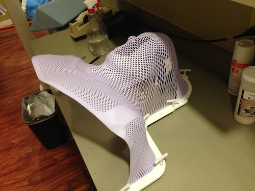

#############
The Next Step
#############

:date: 2013-05-22
:tags: Cancer

Next week, I will start radiation! Hopefully, This process will zap any
lingering cancer cells that my surgeon could not see through the microscope
during my 11 hour ordeal a month ago! We visited with the radiation doctor
yesterday to plan out the process.

****
Wow!
****

The visit started out as usual, the nurse (who worked with me five years ago,
and I like her a lot), took my vitals. (Good thing I have a lot of vitals,
these people are always taking them!) Then she took a look in my mouth. "Is that
hair growing in there?" I had not thought of that, but the plastic surgeon did
put part of the skin from my leg into the left side of my mouth. I was feeling
a bunch of stuff in there, but thought it was sutures to hold everything in
place. Most of what I was feeling was sutures that are supposed to dissolve,
but the rest was LEG HAIR! Yikes, I might have to shave the inside of my mouth! 

Then the good doctor showed up. He always dresses like he just got off the
plane from Hawaii. And he does have a sense of humor, which I like a lot.

He started off by reading the surgical report my surgeon wrote up after the 11 hour
surgery. As he was reading, he said "wow!". Not once, but twice!. My wife and I
exchanged glances, wondering what the "wow" was all about. He simple said that
this was an interesting surgery!. Let's see, I have heard that before. Always
glad to make things interesting for my doctors (and nurses). My primary surgeon
has a reputation of being the one to go to for the tough surgeries!. Guess mine
was one of those!

After verifying that my surgeon got everything he could find, which says there
are no visible cancer cells around, the radiation program is pretty simple to
set up. The doctor takes all the imaging available and "fuses" them into a
single plot of where the cancer was. He then lays out a radiation pattern that will
target that area, and the area around where the cancer was found. The idea is
to blast away any lingering microscopic cells the surgeon was not able to
detect. As far as we can tell, the last time I went through this, the radiation
process was completely successful, since the area he radiated was free of new
cancer. That is very good! It also means that this treatment will cover tissue
not radiated earlier.  Had the cancer reoccurred in the same place, the
radiation would not be anywhere near as effective. So all things look pretty
good.

We finished out by scheduling the treatment sessions, which will involve 35
treatments, five days a week for seven weeks. I commented that he should make a
good guess where things might pop up next so we can get ahead of this beast.
Without missing a beat, he said "OK, I will be doing a rectal exam next!". Told
you he has a wicked sense of humor!

******
Eating
******

One other concern I have is that I do not want to lose my current mouth
opening. During the first round of radiation, the muscles that open and close
my mouth (at least on the left side) were fused into a solid that would not
allow my mouth to open very far. Over the last five years, the opening seemed to have
closed down to the point where I was worrying that something would need to
happen to fix that. What did happen was this second round of cancer and the
second surgery. As part of this surgery, the doctor was forced to cut away some
of the muscle keeping my mouth from opening, and the result is that it now opens
three times as far as before. Still not perfect, but a whole lot better than it
was. I do not want to lose that improvement, so we talked about that a bit.
Hopefully, the radiation program will limit any impact in this area!

***************
Noodle Strainer
***************

After we finished talking to the doctor, I went into the lab where the CT scan
machine is kept. There, I saw a flat plastic outline of a head with a purple
mesh in the middle. The technician took that gadget and dropped it into a tub
of hot water while he set me up for another CT scan. Another technician, again
one I remember from five years ago, showed up to help set me up. After getting
me laid down on the bed that rides through the machine, they brought that silly
mesh gadget over and pushed it over my face. The hot water had softened the
mesh which stretched over my head to form a mask I will wear for each radiation
treatment. It cooled after a while into a solid that will hold my head in
exactly the same orientation every time. They marked target points on that mask
which will be used to align things for each treatment. Then I took the ride
through the machine.

When this was over, we were done for the day. The treatment schedule is set,
and the doctor will program the machine to make the scans. As I recall, each
treatment involves about a dozen short bursts aimed through a metal grid that
focuses the beam into exactly the area the doctor wants to target. Each burst
happens from a different direction. Each shot damages some tissue, but that
damage will heal. What will not heal is the real target point which gets hit
multiple times from different directions. All told, the process can target a
single cubic millimeter of tissue anywhere in the body. Pretty amazing. 

I have done this before, and it is not actually painful, but it does wear on
you and there is pain involved, but it is more like an ache that gets worse as
the treatments progress. We are hoping my throat will not be affected much and I
will be able to swallow through this. Last time I did this, I used a feeding
tube in my stomach to pour in Ensure. If things go wrong, this may happen again,
but we are hoping for the best.

************
Finishing up
************

As we left, we were marveling that the entire staff in the radiation center is
the same bunch we worked with five years ago. That is pretty amazing, and a
testament to this doctor! His folks like what they do, and like who they work
with. My kind of people.

As for the hair in my mouth? The doctor said he would take care of that. Zap -
it will be gone!

Cool

**********
Postscript
**********

I keep trying to motivate my students to find something that will lead them to a
fulfilling career. Sometimes, the reasons for this get clouded. Today, I was
reminded of another goal I should help my students reach - Health Care!

In the mail this afternoon, I got the first bill from the hospital where I had
my cancer surgery. The bill for my 16 day stay was $199,000. By itself, this is
a staggering number, and if you have no medical insurance, guess what? You get to
pay this bill!

However, since I do have health insurance, the "HMO Adjustment was $129,000
leaving me with a bill of $70,000 for the surgery. My insurance system will pay
most (if not all) of this. The scary part is that those folks with no insurance
do not get this "adjustment" and even if they did, may still be liable for a
huge bill. 

Why our health system works this way is a mystery to me. It makes no sense to
bill at such a high level only to "adjust" it to a lower number. Why cannot we
just bill a reasonable amount and stop the silliness of "adjustments"?  

So, my adjusted goal for my students is simple. Get interested enough in
something to have an amazing career doing it, and make sure you get a good
medical benefits package to go along with it. It is too scary to even think
about missing that last part. You never know when you might really need it!

