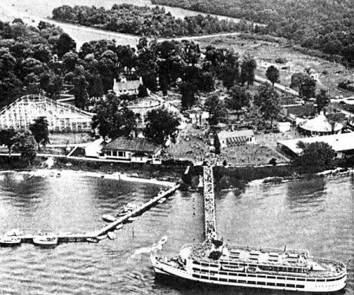

###########################
Glen Echo and Marshall Hall
###########################

:date: 2013-05-24
:tags:  Stories

After looking at a video clip of the old DC Transit trolley riding the tracks
to Glen Echo, I decided to add my memories of visiting amusement parks near D.C
when I was growing up.

******************
Riding the trolley
******************

In an earlier post, I talked about my adventures riding the bus system around
Virginia, D.C, and Maryland as a kid. By far my favorite ride was on the
trolley going to Glen Echo Amusement Park on the Maryland side of the Potomac
River.

That trolley in this picture (from http://dc.about.com) has obviously seen
better days, but it is exactly like those I used to ride whenever I had enough
money to consider going there. 

I would ride the bus to Roslynn on the Virginia side of Key Bridge which
crossed the Potomac near Georgetown University (where I was born). The trolleys
crossed the bridge, then circled around at a station before returning over to
the D.C side. The trolley that went upriver to Glen Echo ran through the
streets of Georgetown before reaching old train tracks that ran just in the
trees above the C&O canal.

(This image is from www.pollythetrvelingfrog.com) This canal is a historic
system that was built in the mid 1800's and today serves as a very nice hiking
and biking path. 

The trolley ride was always fun. The trolley was powered by electric lines in
the street while in the city, but switched to overhead power wires for the ride
to Glen Echo.

**************
Glen Echo Park
**************

This park was a kids dream, it had everything an old fashioned park needed,
especially an old wooden roller coaster. By today's standards it was pretty
tame, but back then it was something to ride over and over. When we went to the
park in a group, some of us would do nothing but ride that silly coaster until
they threw us out. It was always my first stop in the park. We rode the thing
so many times, we knew every bump in the tracks. Of course, the best seat was
in the first car, and of course, real men never held on, in fact you were
supposed to hold your arms up for the entire ride. I am pretty sure I mastered
that skill!

The park also has a Carousel, as all parks were required to have. This one was very classy!

The park also had Bumper cars, a really nice swimming pool that we
went to on field trips in school. There was a Ferris Wheel and the required
Octopus ride guaranteed to make you lose your lunch. There was also a simple
ride that had chairs on the end of very long chains, and all it did was spin
around forever. I know this all seems silly now, but in the 50's and 60's this
was the place to be if you were a kid! I remember riding that chair ride and
getting hit in the head by some kind of nut. I blamed that incident of a
demented squirrel who was mad at all of us for making so much noise near his
tree!

Most of these rides were pretty tame, especially the carousel, but if you could
just reach that silly ring sitting in a chute just out of reach for most folks,
you might score a free ride. (As I remember there were steel rings, that got
you something, and brass rings that got the free ride) So, we rode these other
rides when the line for the roller coaster got too long!

**********************
Walking when necessary
**********************

Now, kids MUST go to such places, and with my paper route, I usually had enough
money to ride the trolley if needed. However, I do remember one particular
weekend, when my feeble brain told me to go to the park. I did not have enough
money to ride the trolley and all the rides I wanted to ride, so I convinced
myself that I should walk there! So, I took off in the morning, and headed
toward the old Chain Bridge which crossed the Potomac near the "Little Falls"
area, about five miles from home. I then wandered down to the C&O canal, and
headed upriver to Glen Echo. Total distance about 10 miles. If that seems
insane today for a kid to do, these were simpler times, and I never felt like I
was unsafe, just tired when I go to the park. I remember doing the normal kid
thing, and riding every ride I could get to. But then I realized had a huge
problem.

My eagerness to ride overpowered my good sense (if I had any) and I spend all
my money on rides. Tilt! How was I going to get home? My plan was to ride the
trolley back, then the bus home. Only problem was I had no funds to do that,
and walking would have meant I got home after dark. I would never have survived
that. So, I did what any resourceful kid would do, I panhandled! It was sort of
embarrassing, but I stood near the trolley stop and started asking strangers if
they could spare a dime so I could get home. I never told them I was totally
broke, a dime would be easy to part with, and if enough folks fell for that, I
was set. I am not proud to say I managed to get enough to ride back home, and
survived to visit the park another day. 

*************
Marshall Hall
*************

There was another park on the Maryland side of the Potomac, but this one was
well down river from D.C. I do not recall ever going there except with my
cousins who lived in Maryland. I do not remember much about that park, but I do
remember one special trip.

My uncle's dad was in the Navy during WWII, and his sons grew up with a love
for boats. My Uncle and his brother bought a really neat Cris-Craft cabin
cruiser (probably 40 feet long) that could sleep probably six or so folks below
deck. On one special weekend, my family got invited to take a trip to Marshall
Hall on this boat. WOW! The boat was kept at a boat dock near Anacostia near
D.C, and we headed down river for a leisurely cruise.  We did a little fishing
off the back of the boat as we cruised, but all we caught was a catfish or two.
Nothing that ugly should ever be eaten, so we threw them back as soon as we saw
what was on the line. I never got into fishing, probably the sight of that
catfish staring at me did that thought in!

Mount Vernon
============

If you were luck enough to have a boat, you could pull up to the dock on the
river at Mount Vernon and visit George's place. We pulled in and did just that.
Boy, did we feel special. All those other landlubbers had to get there in cars,
and we felt pretty keen strolling up the dock from out "yacht". 

After a short visit (we had been there many times on school field trips), we
pulled out and continued down river to Marshall Hall. Once again, we got to
show off by arriving at the park where the big-shots arrived. I remember
starting off for the roller coaster with my cousins. I am pretty sure my two
sisters chickened out on that ride. However, we had a problem with this park
visit.

There was a river cruise ship, not all that big, that left D.C., with several
hundred passengers on the same trip we were taking. Just our luck, that silly
ship arrived at Marshall Hall just as we were getting into the rides. My Uncle
had to get his boat out of the way, so we cut our visit short, ran down the
dock and pulled the cruiser away for the real ship to pull in. I will admit it
was kind of fun making that ship wait until we got clear. 

On the ride back upriver, we had one short event that was memorable. A sailboat
had gotten a little too frisky and capsized in the middle of the river as we
were approaching. My uncle decided to do the right thing and we puled up nearby
and pulled the crew out of the water. We then proceeded to spend a few minutes
trying to figure out how to get the sailboat back upright. As I recall, that
involved diving into the water and getting the sails loose from the mast. Once
that had been done, the weight holding the ship upside down was off, and the
keel pulled the sailboat onto its side. With a little rope action, we convinced
it to get back upright. The crew had some bailing to do but they were fine, and
we were on our way, happy in our new role as heroes for the day!

*******************
The end of this era
*******************

I remember going to the Glen Echo Park in my high school days when one of my friends had
a car, but the park was getting pretty run down. We got there early and were in
line for the first ride on the roller coaster. As I recall, they let the
coaster run the tracks by itself for the first trip of the day, so we watched
it slip down the tracks and head up that long clanky climb to the first huge
drop that was supposed to scare everyone! We sat there waiting for the coaster
to return, but it never did. Apparently, it got to the first hard left turn and
decided to go straight.  Obviously, we did not ride the coaster that day, or
any other days after that.  I believe they closed the park down shortly after
that.

Glen Echo survives today as an event center. Many of the original structures are
there, but the rides are long gone. Shoot, who wants to ride a silly bumper car
when they can do barrel rolls and loops on something much more thrilling. Me, I
would rather do all of that in an aerobatic airplane. That is MY idea of fun!

