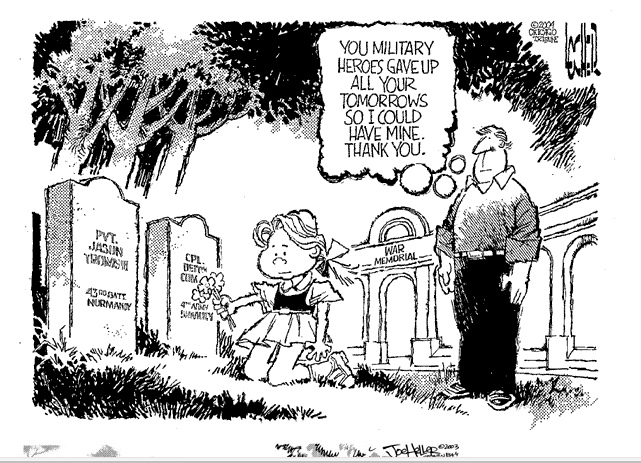

##################
Memorial Day, 2013
##################

:date: 2013-05-27
:tags: Veterans

This cartoon came in an email today, one of a series of cartoons focusing
attention on Memorial Day.

I saw a discussion on the web a few days ago claiming that the "new" meaning of
Memorial Day had turned it into a general day for honoring those who have died,
not just those who served this great country. That is just plain wrong!. Here
is a quote from the Honorable Dr. Donald C. Winter, 74th Secretary of the Navy

::

    Originally called Decoration Day, Memorial Day is a day of remembrance for
    those who have died in our nation's service. It was first observed on May
    30, 1868, when flowers were placed on Union and Confederate Soldiers graves
    in Arlington National Cemetery. Ever since, Americans have set aside a day
    in May to observe Memorial Day and pay tribute to those who made the
    ultimate sacrifice in defense of our great nation.

    In December of 2000, the "National Moment of Remembrance" Resolution was
    passed, reminding Americans of the true purpose of this day of reflection.
    The resolution asks all Americans "to voluntarily and informally observe in
    their own way a moment of remembrance and respect, pausing from whatever
    they are doing for a moment of silence or listening to Taps" at 3:00 p.m.
    local time. This year, as we reflect on the achievements and sacrifices of
    all who have served, I encourage you to remember and honor all those who
    have lost their lives defending this nation's ideals of freedom and
    democracy, not for just a moment, but rather throughout the day. We owe
    them a debt of gratitude for preserving the blessings of liberty that we
    claim as our birthright.

I did serve, and I grew up hearing many who survived this nation's wars speak
of those who did not survive. Out of respect for those fallen soldiers, I
observe Memorial Day with the respect due to the real heroes of this nation.
They deserve nothing less!

Roie R. Black
Major, USAF (Retired)

