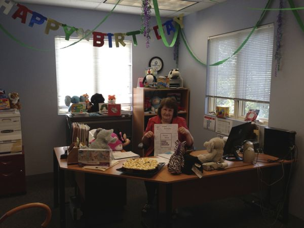
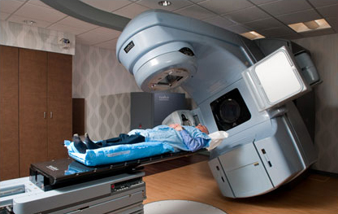

##################
Radiation log 2013
##################

:date: 2013-05-28
:tags: Cancer

I am not sure how this will work, but I am going to try to build a single page
with a log of the radiation adventure. I suspect most of it will be a bit
boring, but I am posting it for those who are keeping tabs on me and my
treatments. I do hear from a few of you, so here goes!

..  note::

    I have rearranged these notes so the most current message is at the top.
    This page will get LONG if I post something every day!

**************
July 17 (35/0)
**************

Hooray! The end is here. Today was the last treatment, and it went well. The
session was a bit long, waiting for the machine to reboot and a few xrays to be
taken, but the bug zapper did its thing just like always. Hopefully, I will not
need to use this beast again.

If you ever need to go through a treatment process like I have here, I hope you
get a team as skilled, friendly, and just plain as much fun as these fine folks
have been. Most of them were with me five years ago, so I owe them my life
twice. 

We gave all the team thank-you cards that Cheryl made for me. I added a
personal note to each. We also bought a bunch of pizza gift cards, and gave
those to Dana so they can have a pizza party, or she can give the cards to the
team individually. We did something like this for the nurses in the Intensive
Care facility I stayed in right after my surgery. We hope they enjoy the break.
The certainly deserve it!

Thanks to all for saving my life, again!

**************
July 16 (34/1)
**************

One more to go! Tomorrow is party day!

Connie drove me to the treatment today. She is getting the hang of driving in
Austin. The place was a bit crowded again, but I got in fairly quickly. The
team got me bolted down and the treatment started with no incident. I must have
dozed off, because I swear they did not fire off all the normal number of
shots. They swore they did, but my mind disagrees. Oh well, only one more to
go. 

I am feeling pretty good today, much better than yesterday There is no way to
know when I will feel good or bad through this. Fortunately, the pain medicine
they gave me keeps things on a even keel. And, I am not using very much of that
at all. This whole adventure has been much easier to get through that the
procedures from five years ago.

Thanks to all who have watched over me, and prayed with us as we worked through
all of this. And thanks are especially due to the team at Dr. Dziuk's radiation
center. They are a great bunch. Tomorrow, we will thank them properly!

I am capping this day off with my normal four mile walk. Hopefully a dry one
this time, but the clouds are building!

**************
July 15 (33/2)
**************

The last week! Yesterday, we put my youngest sister ,Karen, on a plane to Seattle
leaving my oldest sister, Connie, to help us out for the next two weeks. I am doing
fine, but it has been excessively hot (104+) so I quit walking for a few days.
The clouds rolled in yesterday afternoon and the temperature dropped into the
high 80's (freezing for these parts). I took off on a short walk, got about two
miles in, and the sky cut loose! We hardly ever get drenching rain here, so naturally
it had to happen on my walk. I got drowned on the last mile of my circuit.
Cheryl looked on my Facebook page to see where I was, and drove out to rescue
me. The problem with that idea was that I was so wet, I would have drowned the
car. So, I finished my short three mile walk and dried out when I got home. No
cooling off needed, I was fine when I got home.

I should comment on an adventure we did on Saturday evening. My youngest
sister, Karen, used to sell Mary Kay cosmetics, so she knows a thing or two
about all that cosmetics stuff. Both of my sisters dragged me to an Ulta
Beauty (!) store up the road to look into cosmetics to help blend in the skin
color difference on my face. My leg is not as tanned as my face, so the "clam"
is much whiter than the rest of my face. We ended up buying a "camouflage"
cream and remover (who knew you needed such things) that will color the clam to
look more like my other face skin. Boy, I did not really want to know about all
that! I will need practice putting all this on. Probably, I will be getting up
with my wife so she can supervise me putting on my makeup. At least until I
manage to get the clam tuned up and tanned more. I will only be doing that when
I go back to work!

It rained again today, so I had to teach Connie how to drive in Texas on wet
streets. (Hint, think snow in the rest of the world!) On the way to the
treatment, the traffic on our main road slowed to a crawl. Probably a slippery
road fender bender. Turned out to be just that, but the pair was interesting. A
young girl in a Honda in front of a man in a police uniform driving a small
pickup. Boy, that one is going to be hard to explain for someone!

We made it to the radiation center in one piece. The place was packed, though,
and we almost did not get a parking pace. I was expecting a long wait, but they
called me in right away. I must have special privileges! The treatment went
smoothly, now that we all know what to do. Great, but there are only two more
then we are done. Yea!

**************
July 12 (32/3)
**************

We had a busy day, today. First, we visited with "Top Doc", my primary surgeon
who leads the team. He wanted to check on my ear after a few weeks of ear drops
and more radiation. He was pleased with the overall progress, and the fact that
my hearing is fine, just impaired by fluid behind my ear drum. He thinks that
will improve after radiation stops. He also inspected my mouth and is happy
with that as well. He said that the "flap", as they call it, (I prefer "clam")
on my face will continue to shrink after radiation ends, and thinks we should
wait a few months before worrying about adjusting anything. What I do not like
about that is that I probably get to live with the trach until the surgery that
will tune my face up. Oh well!

He was a bit concerned that we had not checked my thyroid functioning during
radiation, so he ordered up a thyroid check. Getting tired is natural during
radiation, but can also be a sign of problems with the thyroid, so he wanted to
check to be sure. That caused us to walk across the street to my Oncologists
office to do the blood work. Following that, my sisters and I went to lunch to
kill time until the radiation treatment.

We all went into the treatment area so Connie could see the machine and watch
them bolt me to the table. It is an interesting sight, and an amazing machine.
They would not let my sisters hang around for the actual treatment. No
distractions allowed, which is fine by me. I do not want them accidentally
blowing up my big toe!

The treatment went fine, and I let Connie drive us home to see if she could
navigate Austin Traffic. As usual, the roads were packed, and it was only 2:30
in the afternoon. Remember, Austin is full, stay away!

My sisters are both impressed with how friendly all the folks are in all the
doctor's offices we have been visiting. Apparently, their experiences in the
DC area are much less fun. Not surprising, given the environment around the
Capitol. Too many politicians, real and wannabe, to suit me!

Only three more treatments to go! Yea!! Now for a couple of days rest.

**************
July 11 (31/4)
**************

Another routine treatment. Looks like I will get out of this round with minimal
problems. I almost fell asleep on the table! Both of my sisters went with me,
so this was a training session for Connie, who takes over watching/helping me
after Karen leaves on Sunday.

**************
July 10 (30/5)
**************

..  note::

    Today, I got permission to use the tech's names (phew, now I need to make
    sure they are right!) I have been leaving their names off so they would
    remain annonymous in these posts, in case they might bject to some of my
    "humor".

Busy day, today. My older-younger sister (middle child, Connie) flew in today
from D.C for her two week stay, and it was doctor day. So, we sent my younger
sister, Karen, off to fetch her at the airport (dangerous, since she is not
familiar with the roads around here).  Cheryl and I went off to the
treatment. The place was packed, not a good thing, really, so we did not get in
too early. One of my favorite techs, Heather, finally called me in I found out
that she and Scarlett (another from my earlier days here) were ganging up on
a poor student male showing him how to set up the funny cardboard. The girls
are picky (!) but he figured things out. Since he is not on the bite list, he
was not at risk of getting bitten (perhaps!). The three of them got me set up
just fine and the treatment went well. However, instead of moving straight into
a room to visit with the doctor, we had to wait a bit until he was finished
with others and a room opened up.

I got am email from one of my classmates from high school today suggesting that I
need a tee-shirt with "Radiant Roie" on it for my last treatment (thanks, Judy,
for the idea.) I told the techs about that, and they all thought it was a neat
idea so I may have a job for my sisters! I also showed Heather how to get to my
blog, and she came out as we waited for the doctor to tell us that we are
neighbors! Turns out she lives a few blocks from me. 
She saw the Fourth of July parade post and realized we were both
sitting at about the same spot for the parade. Small world!.

(Now that they know about this blog, I better be careful with these posts, they
still have me under their control for another week!) We are impressed with all
of the team at this center, but hope we are close to being done with their
services! I have to tell you, it was comforting to see familiar faces when we
came back into the center for round two of treatments!

When we finally were called in to see the doctor, the review went very well. He
is quite pleased with the treatment progress and how well I am doing through it
all. I am no where as drained and sick as I was during the last round of
radiation, so he is very happy with the whole thing. One more week and we will
be done! Yeah!

After that, we move into a waiting and checking mode. We will do a sweep of all
the doctors about a month after the radiation work ends, then do a PET scan to
make sure nothing is visible (that is the best test for that). Then we go
through a period of three month checks for a couple of years, then six month
checks up to the five year point, then checks are supposed to go to yearly.
Since my new cancer showed up on that last six month check, we will see if we
go to yearly checks. Had I not caught this new tumor on this check, I might not
have caught it in time to stop it. Boy, that was a good thing. Someone up there
was watching over me!

All of us went out to dinner tonight, and got ready for bed scattered all over
the house. We even had banana splits to celebrate the good review (not that
you need an excuse for those - HA!)

*************
July 9 (29/6) 
*************

Hey, we only have a few more of these to go! 

Today, I had to take my sister to see my dentist before my treatment. She
managed to break a tooth, not quite sure how, but it needs looking at before
she gets home. My dentist is great, she found a way to squeeze my sister in to
deal with this before we send her out west. I seem to have great doctors
everywhere I look and I am thankful for that! (It turned out she only broke a
crown and did not need any work until she gets home, the metal they put in to
hold the crown will protect the tooth for a while.)

The treatment session was fun. Yesterday none of my favorite crew was there to
bolt me in, but today one of my favorite techs came out to get me from the
waiting area.  When we got in the room, a student was there. I found out they
were all busy with another patient on Monday. Of course, the student was told
to put the cardboard in my mouth, and she ran smack into the bidding war to see
who I would bite when they do this. (You have fun where you can in this
situation). So far, the bid has been $30, but it got upped to $40 toady.
Looking a bit fearful, she said "don't bite me, I am only a student!" To which
I replied "I am a teacher, I am supposed to inflict pain on students!" HA! She
still looked nervous, but got the cardboard in my mouth with no harm (wonder
what the bid needs to be to convince me!) As they were bolting me down, I
noticed a second of my favorite techs had showed up, and as I was loosing the
ability to see in the room from the mask, a third tech showed up. Yikes!
Quadruple teaming! I must be entertaining, since that was just about all the
available techs, all coming in to see me! (Or to see if today was the day I
would bite someone!) Such fun!

After all that, the buzzing of the machine was a letdown!

With only a week to go, I am hoping this round does not get much worse. So far,
I am dealing with mild headaches, a lot of fatigue (meaning I sleep a lot) and
a feeling that I should be doing more than I am. At what I am not sure.
However, since I am getting set up with my teaching load for Fall, all of a
sudden, I need to get web sites set up and course notes in place. The
workaholic that I am is anxious to get at that, but my motivation needs
adjusting. I get started on projects, then lose interest quickly as I get
tired! I still have about six weeks to go before classes start, so I do have
time!

I managed to walk my four mile loop tonight, that helps clear my mind! I
believe it is helping so I keep plugging away. The new Facebook connection
occasionally results in a cheer as I walk, which is kind of neat, even if I
would rather my friends not live on Facebook!

BTW. I passed one of the Google mapping cars parked on the side of the road
near my house today. It was a Toyota Prius (they need to get good mileage doing
all that driving) with a soccer ball camera rig mounted on a short tower on top
of the roof. The Google paint job gave it away.  So much for stealth!

*************
July 8 (28/7)
*************

After a nice weekend break, the treatment today went fine. They managed to get
me lined up with no problems. The place was a bit more quiet than normal, and
my compliment of techs seemed to be missing. The doctor said they were going to
be working over the fourth because they have a patient who is pretty sick and
needs treatments, so maybe they got a long weekend to make up for it. 

I have skipped walking for a few days, because we are getting busy dealing with
a few things at home. My other sister will be coming in tomorrow, so we need to
get ready for her. That will make for a full house for a few days until my
little sister heads off to Washington state to visit her son. 

*************
July 5 (27/8)
*************

Well, after a nice day off, the final treatment of the week was a simple
affair. They did need to reposition me a couple of times to get things lined
up, so it took a bit longer than normal. I could feel the difference when they
clamped down the mask. The pressure on my face was a bit different. It took two
tweaks to get it lined up right!

We are all thankful that this round of treatments is going so well. I am
dealing with a bit of pain, but not enough to drive me into excessive pain
medication. I am noticing a tendency toward more headaches, which is probably
logical given where the treatments are focusing.  I am looking forward to the
break over the weekend!

*********************
July 4 (no treatment)
*********************

Happy Birthday America!

We get this day off, so my sister and I went to the neighborhood parade. I rode
in an Army truck last year, but this year, we sat on the side of the road and
watched. Short, but cute.

* `Parade </blog/2013/07/04/Parade_.html>`_

**************
July 3 (26/9)
**************

Another good treatment, and another good doctor visit. Everything is going
smoothly in the treatments, but I am really beginning to notice its effects. We
visited with the doctor and he is quite pleased with my progress. My "thrush"
is gone, and my skin is not as burned as it was last time. We credit the
ointment they gave up for keeping things under control. 

The worst thing I am dealing with is extreme fatigue. I walked after this
treatment, and that went well, but I was off to bed around 8:30! I never go to
bed that early. I managed to sleep through until about 4AM, then was up until
time to feed the kitties. (Did you know that they needed to be fed at 5:30? I
have no idea why that is, but if someone does not get up then to feed them, one
of them bites one of us to get us up. Usually that means Cheryl gets up, since
she is at the bottom of the pecking order in our "pride"!) I went back to sleep
after that and slept until around 8AM. That is a lot of sleep, but it seems to
help. 

**************
July 2 (25/10)
**************

Hey, we are in the final countdown! Today was a training day, and another
"volunteer" put the cardboard gadget in my mouth. The techs are doing their
best to convince the new folks that I will bite them. HA! Still, the offer is
only $30 from one of them. I told her to bump up the bid and we will see what
happens. Always nice to have a bit of fun before the buzzing begins. 

My jaw is still sore, and I am noticeably more tired. I am going to bed pretty
early these days, and I suspect that will continue. Tomorrow is "Doctor Day" so
we will have a few things to discuss.  My sister is getting into the swing of
helping out. On the way home, we stopped and shopped so she could make dinner.
Cheryl was very happy not to have to do this when she got home from work!

**************
July 1 (24/11)
**************

Another Pleasant Valley Monday! (OK, you have to be old to figure that
reference out!) Before my treatment, I had to go to the airport and fetch my
little sister. Her flight out was a mess, she left the house at 3AM in D.C and
headed to Dulles Airport for the first hop of a three hop flight. D.C to
Charlotte, to Dallas to Austin. To say she was wiped out was an understatement.
We managed to get away in time to drive back home and get lunch before taking
off for the Radiation Clinic. Fortunately, the treatment went smoothly, but
since this is the first of the month, the team working on getting me situated
swapped. Oh Boy! New people to pester!. 

I am really starting to notice that I am getting tired, and I have a bit of
pain in my jaw on the side they are working on. We will go over that on
Wednesday. 

Even though I am getting tired by all this, I did do my four mile walk. I want
to do that as much as possible. No one "liked" this one, so the cheering was
missing. Actually, that is a good thing. I don't want folks living on Facebook!
If you "accidentally" happen to see my map when I am walking, fine, press the
button if you "like". It is kind of neat.

***************
June 28 (23/12)
***************

Another week down! I believe I have the exact timing of a treatment down to
where I can tell you what noises to expect every moment of the session. Silly
thing to memorize, but when your sole goal is to get it over, you do things
like that! In any case, this treatment was another ho-hum event, and I like
that. Things should change a bit soon.

Cheryl and I were trying to remember how radiation went last time, and we seem
to recall that it was pretty much a non-event for most of the sessions, then it
got hard fast.  With only two and a half weeks left, I am expecting things to
get harder soon.  The real bad time is actually the two weeks or so after it
all is over. That was a surprise, but you need to remember that the radiation
actually damages you every time. Most of the damage has to heal, but where
beams cross, that damage will not heal, and that is how they zap the cancer
cells! So, the post treatment time is one of healing, and some pain. 

So far, the pain level is very low, but I am getting more tired now, and seem
to want to go to bed very early. I am still trying to walk every other day to
keep my strength up, and that seems to be helping. Today, I discovered a button
on my iPhone app that puts up a map showing where I am walking on my Facebook
page. Also, as I walk. If you push the "like" button on that Facebook map, I
hear a weird "cheer" which is kind of neat! I got three of them as I walked my
four-mile loop. (Some of you spend way too much time on Facebook!)

On Monday, my little sister, Karen, is coming to stay for a while and help with
things as the treatments get harder on me. Then my other sister, Connie, will
take over for a while longer, to cover part of the post treatment time. That
should help both Cheryl and I!  Until then we get to relax for the weekend!

***************
June 27 (22/13)
***************

Happy Birthday, Cheryl!

Today is Cheryl's birthday. So, I had to go visit her office after my treatment
to see what they had done for her birthday. It was really cute - her office was
all full of toys and streamers. Here is a picture that does not do the room
justice!

Most of the toys are headed to the Dell Children's Hospital in Austin later, or
else the cats will be having a ball with them!

My treatment was early today for a number of reasons. The doctor was going to
leave early and the machine needed maintenance so they shifted a lot of folks
to earlier times. I got there around 8AM and was in the mask in short order.
The mask felt a bit looser today, maybe my clam is shrinking. I sure hope so!
Otherwise, the treatment went by quickly and I was out of there in about 20
minutes! 

Tonight, we are off to Outback Steakhouse for dinner! We have to get her her
new iPhone this weekend. (She turned down a Barry Manilow concert for the new
phone! I was amazed at that!) If I didn't get her a new one, she would be using
the oldest iPhone on the planet. Her current one is a gen-2 version that Apple
will not even update any more!

***************
June 26 (21/14)
***************

Doctor visit day! It seems like it takes more and more techs to bolt me in
these days. Or else it is my charming personality! In any case, there were four
techs working in the room today, and things went smoothly again.

We left the AFLAC forms with the nurse today and hope to get them back soon. I
am anxious to see how the "duck" does with this process. 

We visited with the doctor again, and he is pleased with my progress. The
cardboard insert they are using is keeping my tongue from getting too sore, and
the medicine has reversed the thrush problem. It is almost gone!. The doctor
seems to like measuring how far I can open my mouth. I really want that to stay
where it is, and so far, it is doing fine. Eating is much easier with more
space between my teeth. (I have almost three times the opening now.!)

When I got home, I got a call from the center asking if I would come in early.
I said I would, but I have no idea why they need this. I will find out
tomorrow.

All in all, things are still going pretty well, except I am noticing that my
energy level is falling off. I seem to want to go to sleep very early, and that
is weird for a night person like me!

***************
June 25 (20/15)
***************

We are making progress, only 15 more of these sessions.

I went in early to deal with the medical paper mill We are trying to file forms
to get something from the "Duck" (our AFLAC policy). Of course the required
paperwork is impossible to figure out. After talking to the finance person at
the radiation clinic, and my favorite nurse, we came up with a plan on how ot
submit the forms. Of course, we have to Google for the forms, but that should
work.

As I was talking to the nurse, I looked around and my two radiation techs were
standing there waiting to lead me into my favorite room. I was surprised since
I was a half hour early! We got in and out in pretty short order with no issues
again. 

Since I got dome early, I decided to stop by work and say hello. My boss is
going to start figuring out what courses I will be teaching in the Fall term.
As long as I get my favorite course (assembly language for those who know about
such things), I am pretty flexible about what I will teach. Other teachers get
pretty picky about what they will teach, I have never understood that. I cannot
think of a course I would not teach if needed. (Wait there is probably one, but
just because i hate that programming language, I will not name it!)

Tomorrow is doctor visit day. We will try to get the AFLAC paper mill set up so
we can submit it with his signature! 

***************
June 24 (19/16)
***************

Another week starts, and thankfully, nothing out of the ordinary happened
today. One of the techs who was off last week, thought she saw some shrinkage
in my cheek clam. I hope that is tru, but I cannot see it. Maybe the pictures I
am still taking each day will show something.

I am noticing that I am much more tired after treatments now. I was tired
enough to go to bed at 9PM, when I normally just get going for the evening. I
did not walk today, since I was so tired. Hopefully, I can do that tomorrow.

***************
June 21 (18/17)
***************

Yeah! Officially more than half way!

Before the treatment, I went to "Top Doc" and he cleaned out my ear. He even used
a microscope gadget to do the job so he could see clearly that he was not
damaging my ear drum. The radiation makes that dangerous enough that he has to
be careful. If the ear drum gets damaged, it will not heal very well. It turns
out that there is fluid behind the ear drum, most likely induced by the
radiation. That is what is making me deaf in that ear. My sinus is closed on
that side as well, and that may be due to the surgery work they did. We will
not know how all this will work out until after the radiation treatments are
over and things heal a bit. In the meantime, I am not to let water in that ear,
and have to use ear drops that sting when they go in to keep it as clean as
possible during treatment. Cheryl is impressed with the small pharmacy we have
set up in the kitchen with all the drugs I get to play with.

The treatment went well again. The cardboard mask they are using is keeping my
tongue from getting too sore, at least so far. After the treatment, one of the
techs looked in my mouth and discovered a case of thrush (isn't that a bird?).
This is a white area that looks like snow that is caused by the radiation. I get yet
another drug to deal with that. Yeah! The pharmacy loves me!

At least I get a few days off. Good thing, as I am pretty tired these days!
Part of that has to be the trip we took, but part is the radiation at work.

***************
June 20 (17/18)
***************

Another non-event day. However, my left ear is fully clogged up, and the doctor
thinks it is wax buildup and wants me to get my ENT doctor (Top Doc) to do a
roto-rooter job on it to clear it out. So, I have an appointment to do that
tomorrow. Hopefully that will cure the problem.

***************
June 19 (16/19)
***************

Today was very tiring. We got up at 3:30 DC time (2:30AM Austin time) to head
to the airport. The flight out from Baltimore was at 6:30 and we made Atlanta
around 9:30. Then we sat for 2.5 hours before we boarded for Austin. We ended
up at our car about 1PM and headed to the clinic for my treatment. Fortunately,
that went well, with no problems. Our visit with the doctor (it was Wednesday)
turned up an uncomfortable fact. The shrinking of the patch on my cheek could
take a year to complete in the worst case. We had been hoping to see something
happen during treatment, but the doctor said that sometimes the body does this
work after everything is over. I am not sure how that happens, but living for a
year with this clam on my face is not something I am looking forward to. Oh
well, considering the alternatives...

Including a three hour nap after we got home, I think I slept for almost 11
hours this evening. I must have been really tired by all this traveling!

**********************
June 18 (No treatment)
**********************

Today was Andy Tarapchak's memorial service, in Herndon, VA.. The service was
held in the same room where my mother's funeral was held 20 years earlier. It
felt strange to be there remembering Andy walking in to my mom's funeral. I got
to talk to a number of Andy's relatives, most of whom knew how much a part of
Andy's life my family had been, so we were welcomed there by all. I saw many of
them at Evelyn's funeral about six years ago, just before my first adventure
with cancer started. There were a number of senior folks from the Washington
Gas-Light Company where Andy worked for all those years. In all, it was a nice
service. Andy will not be buried at Arlington. Per his wishes, his nephew will
take care of his final resting place, probably in Pennsylvania where he grew
up. Rest in Peace good friend!

After the service, my family went out for lunch and back home to get some rest.
We all went out to dinner later, then Cheryl and I drove back to Baltimore so
we would be close to the airport for the early morning flight back home.

***************
June 17 (15/20)
***************

I got in early today so Cheryl and I could head off to DC for Andy's memorial
service. I was in and out in short order. Other than making me tired before the
trip, this treatment was normal.

What was not normal was discovering that all my trip plans on Expedia were
broken. Somehow in the course of setting up the trip, Expedia changed the dates
to a week out. I later figured out how it happened, but I am not happy about
it. If your try for certain dates, they put up a link for the following week i
case the one you are looking for is not available. I must have hit that link by
accident, because my trip was all set for the following week, which was not
going to work. After a furious hour on the phone with Expedia we managed to
find flights almost as good, but at a significantly higher price, plus I had to
pay a flight change fee to even book it. Brother, the airline fee system is a
mess, almost as good as health care. 

I did manage to get flights and a car se tup and we got into Baltimore around
midnight. We still had an hour drive to get to my sister's house. So, the day
ended around 2AM. I finally managed to get some sleep after a hectic day!

***************
June 14 (14/22)
***************

Last day for this week, and I got in early. We had to use a different machine
today, my normal one (Herman) was busy with a man who was brought in in an
Ambulance. Glad to give up my machine for him, he obviously has more problems
than me. The treatment went normally, although the noises were different. Silly
to say, you get used to the exact set of sounds when you do this day after day!

We seem to have a new game going. Earlier this week, when they first put the
cardboard shield in my mouth, the tech said "Don't bite me" as she put it in my
mouth. One of the other techs said "I'll give you five dollars to bite her". I
did not bite her, but the next day the price went up. This time, "I will give
you ten dollars to bite her". I told them it would take at least $20 to get me
to do that. So, today, in a different room with a different tech, as I was
unbolted the new tech said, "OK, I will give you $30 to bite the first tech. I told
her to wear a glove next week, the stakes were getting too high not to bite
someone! HA! (Actually, I might suggest to the doctor that he counsel his
staff, they are getting a bit too frisky!)

***************
June 13 (13/21)
***************

Nothing special happened today. They overcame the problems from Wednesday and
the treatment was uneventful.

***************
June 12 (12/24)
***************

Another doctor's visit day! This one was a mess. After they bolted me to the
table, I say (lay) there forever. Finally, they came back in and told me they
were having trouble lining me up. This has happened before, so it was not big
deal to wiggle a bit to get resettled and try again. Only this one did not
work, and neither did the try after that one. They finally had to get the
doctor involved to figure things out. In all I was bolted to that table for
over a half-hour, and was beginning to get uncomfortable with the whole thing.
Finally they got it done. Cheryl told me later that my face was a bit swollen,
and they had to take another X-Ray to make sure things were aimed right. 

When we finally saw the doctor, he made sure things were fine. My blood pressure
was up a bunch, which they wrote off to the bad treatment. He also reassured us
that the skin graft will shrink dramatically, but that will happen later. The
nurse also noticed that I am growing new hair on the graft, and it is growing
up, not down. Oh, No! The put it on upside down! Will they have to re-do it? I
sure hope not!

We also talked about missing a couple of treatments to go back to DC for my
friend, Andy Tarapchak's memorial. He died on Monday and I will not miss that.
I have posted another message about Andy today as well.

***************
June 11 (11/23)
***************

I got in early today, and the treatment went well. The skin below my left eye
was swollen today. That happened after my treatment on Friday as well, so we
got the doctor in to look things over. He is sure the problem is related to the
surgery, and the pressure the mask is putting on my face. It is just a nuisance
for now. 

***************
June 10 (10/25)
***************

Another week started today. The place was pretty busy this time, not really a
good sign. Anyway, I did not get in early this time and had to read a two year
old magazine on "Southern Living". (Apparently all you do in the South is
decorate and eat!) 

As a result of my sore tongue, they have decided to put a radiation shield in
my mouth to cover a molar that has a lot of metal in it. The Air Force dentists
seemed to like replacing enamel with metal and that far back molar has a lot of
metal in it. The shield is a foil backed chunk of cardboard that tastes
terrible, but I can live with it for the treatment. 

The treatment, itself, was normal. No drama at all. The techs asked me what the
machine's name was (they forgot). I told them to make up a name plate for it! 

After the treatment, I talked to the nurse about some pain medicine. My lower
back and legs are aching at night when I lay down. I suspect it is just a side
effect of spending so much time sitting/laying on a couch. That plus my walking
which has settled on a one hour walk of a bit over four miles. My oncologist
put me on Hydrochodone as a replacement for aspirin before surgery, and I have
tried taking one of those before going to bed, and it seems to help. The nurse
is going to talk to the doctor about getting this prescription refilled. The
pain level will go up as this process gets further along.

*************
June 7 (9/26)
*************

Nothing special happened today. I mentioned that my tongue was beginning to get
sore, and they are going to look into how to limit that. I seem to remember
that happened before. 

When they were putting things back into position after the last shot, the tech
(new guy, I suppose) ran the table into the wall! I was still on the thing,
good thing my feet were not that far down. I did not know the thing cloud move
that far! 

BTW, since they do not seem to have a name for this machine, I told them it
needed a name, and since they could not think of one, its name was Herman. They
thought that was funny!

*************
June 6 (8/27)
*************

Another training day for the techs. As I entered the machine room, there were
two students learning how to make the "bed". They have to place a body formed
pad that holds you in approximately the right place then add a sheet over the
top of the pad. Both students were guys, so I guess they did not know how to
make a bed. Today's session was pretty quick, and they got me in early again.
Nice!

*************
June 5 (7/28)
*************

Another Doctor day! I got to the center about 10 minutes early and they took me
right in. The session was uneventful. Cheryl got there after I went in and was
concerned that I was late. They told her I was in the room already. After the
session we visited with the doctor for a few minutes. With only seven sessions
behind us, there was not much to talk about. We did get some cream to put on
the skin that is getting radiated. One side effect of all this is a sun
(radiation) burn, and the cream will help with that.

Quack!
======

When we got home, we had a message from the duck! When we first got to Austin,
Cheryl had a benefit with her job. It was an AFLAC Cancer Policy that provided
payments for any occurrence of Cancer. We found out that this was a family plan
during my last adventure with cancer. So, we filed the required paperwork to
see what might be covered this time, and guess what! We will be getting
payments for most of the treatments. The size of those payments is very nice,
and Cheryl is convinced I will use this money to buy a ride in a jet fighter.
That has been on my wish list ever since I became a pilot, but I never got a
chance for a ride while in the Air Force. What I really want to do is go
supersonic. To do that, we may need to go to Russia and ride in a Mig-29! That
would be a great adventure. We will see if that happens!

************* 
June 4 (6/29) 
*************

Yea! Finally, we got a treatment with no drama. I suspect they were a bit
embarrassed about the mess that was yesterday! My face is beginning to show
signs of a sunburn, which is one side effect of this zapping device!

************* 
June 3 (5/30) 
*************

Well, after a nice weekend break, the fun starts up again. Since Cheryl had a
meeting conflict, I went to the center by myself again. That is fine, since the
entire things is getting pretty routine for now. She will be with me on
Wednesdays, when we see the doctor to check how things are going.

As usual, I was called into the radiation machine room, and after doing the
voice ID thing (they record you saying your name and birthday to make sure
someone else is not getting your treatment. Really? Who would do such a thing?)

They did the usual, bolting me onto the table and then the techs left the room.
And I waited, and waited, and waited some more! Finally, one of the techs came
back in and told me they needed to reset the computer. OMG! Please tell me this
is not a Windows system! (It is not, but it still needs to be restarted
occasionally.) 

They took off the mask while this was going on, then came back in and we
started it all up again. So, again, I waited, and waited, and waited some more.
Once again, the door opened up and a tech came back in. This time, they were
having trouble aligning my head for the shot, so I had to wiggle a bit to push
my head up into the mask a bit more. His must have worked, because after
waiting a bit more, the buzzing started and I got the full six shot treatment
in. Phew!

As they unbolted my head, one of the techs thanked me for my patience. HA! I
was not patient, I was bolted down, I could not run away. It was getting a bit
claustrophobic in that noodle strainer. Hopefully this will not happen again!

*************
May 31 (4/31)
*************

Today was the end of the first week, and I did this treatment alone. Cheryl is
off to Kansas City to work on our renovation house, and visit with her son and
our grandkid! I drove myself to the treatment. I have not been driving much for
the last month, so I am getting used to traffic again. (BTW, Austin is
officially full, there is no more room! Rush hour starts at 12:00AM and ends
at 11:59PM! Any of you thinking about moving here, GO AWAY! Funny thing though,
the developers are still building luxury apartments, so they must not have
gotten the message!) 

Treatments are back into the routine mode. I know what will happen, and the
only thing is how long I have to sit there before the bump and grind (and buzz)
starts up. One interesting thing today, though. When I got up after they
unbolted me, I almost fell over. The machine tilts, and I guess I had not
noticed that. It was tilted over about 45 degrees, which was weird, and a bit
disorienting! I found this image of a similar machine on the web:

The entire thing moves, I thought it was just the head part that moved. 

*************
May 30 (3/32)
*************

Day 3 was not very exciting, either. They had my name misspelled on one of the
pads they use to align my upper body. I complained and said that whoever
misspelled it was fired. One of the nurses said that the guy who did that
needed to be fired. "I really look forward to telling him he is fired!" was her
comment. Hope she was kidding. MOst of the technicians here seem to be ladies.
Not sure why!

Each shot is fairly short (maybe 15 seconds), but you have to wait between
shots while three things happen. The radiation head (where the beam comes out)
needs to get aligned for the next shot. It can spin around your body in an arc
and move forward and backward some distance. Next, the bed you lay on can be
"nudged" a bit to fine tune the alignment. The bed can raise up and move
forward and backward a short amount. It can even move side to side a bit as
well. This happens in short bumps that move you a bit.  Finally, there are
metal fingers that block parts of the beam to create a radiation pattern the
doctor has programmed. You can hear then slide into position. When the beam
fires, there is a tone that probably lets folks know things are going on. All
in all the entire six shot sequence takes about 10 minutes. Add in the setup
and unbolting process and you have about a 20 minute exercise.

When we got home, I had an envelope waiting for me with an itemized bill for my
hospital stay (not the surgeons part, just the hospital). Reading through that
is a shocker. The ICU room goes for $5300/day, and the Intermediate Care room
is a steal at $3500/day. The surgery room with extended time (11 hours) was
around $45,000 and that does not cover the surgeons bills. Yikes! The only line
that was nice, was the $129,0000 "adjustment: the HMO made. The entire bill for
the 16 day stay was around a dozen pages long. Practically everything they do,
or give to you has a line on this bill. To quote my radiologist: "Wow!"

By the way, Three days in, and I see no sign that this clam on my face is
getting annoyed in any way. Wonder when that will happen!

*************
May 29 (2/33)
*************

Day 2, and we had a meeting scheduled with my Oncologist in addition to
another radiation treatment. Of course, one is in the morning, and the other in
the afternoon, so Cheryl planned on dropping me off in my office while she went
back to work until the radiation appointment. 

We showed up in the Oncologist's office about 15 minutes early and sat down to
read a bunch of old magazines. One of the nurses said that our doctor was
running late and that late meant about 40 minutes behind schedule. Shoot! Those
magazines are pretty lame, but such is health care. Then I had a thought
(strange as that might be)! Maybe the "machine" had room to get us in early! So
I called to check and they said, sure, just get over here NOW!. That was not a
big deal since they were right across the street, so we told folks where we were
going, and headed over.

They got me bolted down pretty quickly and I had another round of zapping,
again with a tight mask and not much excitement (six shots this time). When I
was unbolted, they told me that Wednesdays were "doctors day" when the doctor
checked in to see how treatments were going. With only two behind me, there was
not much to discuss. I did ask about the light flash I noticed and he said that
was a common side effect of the radiation. So were odd noises and even smells!
I was not experiencing any of that, but the flashes are weird and depend on the
angle of the shot. 

We wandered back across the street and had hardly sat down before they called
my name. I was weighed and more of those vital things were stolen from me, then
we sat in the doctors office to wait for him to arrive. The nurse who took the
vitals said "Sorry about the wait", but I thought she said "sorry about the
weight" and I said it really was not that bad, and I was losing weight. Cheryl
just glared at me!

Our big question for the doctor was whether we would be doing any chemotherapy
this time. Last time, I did that, and it was very hard on me, causing nausea
that was hard to control, and I ended up losing a bunch of weight (wait?). The
oncology doctor called our radiation doctor and they talked briefly about the
merits of chemo this time. In the end, they made a decision.

My oncologist said "Chemotherapy will increase your toxicity level which will
impact the efficacy of the radiation." Yeah, right, doc! Why don't we put that
in earth-man speak: "Chemo will screw up radiation" Doctors talk so strangely,
sometimes. So, we decided to skip chemo this time and let the radiation do its
thing!

We got out of the entire adventure before noon, and Cheryl took me home and
went back to work. A successful day!

*************
May 28 (1/34)
*************

Today is the first day of radiation, round two. I also had a short visit with
my primary care doctor to make sure nothing else is messed up. He decided to
take me off of my blood pressure medicine since that has ceased to be a concern
Wonder if something they did during surgery had some effect on that. In any
case, this is a good thing.

The actual radiation treatment was a bit of a ho-hum event. The only thing new
is a procedure I just know is the result of some lawyer getting into things.
Now, I have to sign in outside the treatment room, speak my name and date of
birth, then say where I am going to get zapped, and they record all of this
before I go into the room with the “Machine”. Once the legalities were through,
I walked into the treatment room with two techs. Cheryl came in to see how I
got set up, then they made her go back to the waiting room.

Since I have been through this before, the technicians just told me things were
going to be the same as before (see they remembered me from long ago!) They had
me lay down on the table and clamped the noodle strainer on my head.

Holy Batman! That thing is tight. It must have shrunk since they formed it. In
fact it may be too tight to put up with for 35 sessions. I could not even open
up my eyes since it was pressing on my eyelids! Yikes! I got used to it after a
few minutes, then the “bump and grind” began as the machine positioned me for
the shots. This time, I only had seven shots, instead of the dozen of so I had
last time. That may just be a startup fluke, or the area being treated is
smaller. I am not sure which, but I will see if this changes.

Once again, they said “Here we go” as they walked out of the room. I must not
have been part of the “we”, since I was bolted to the table and could not “go”
anywhere!

The entire treatment took around 15 minutes, most of which I just had to wait
until something happened, then the machine sprang (sprung?) to life and the
buzzing started. For the first few shots, I saw a flash in the side of my
closed eyes, and I am not sure if that was a light on the machine, or a side
effect of the beam hitting near my eye. More puzzles to ponder. Next time I see
the doctor, I will ask a few questions.

When the smoke cleared (sorry, bad pun) we left and went home. As far as I
could tell, nothing happened. However, that is how things started last time, so
again, we will wait and see. Total elapsed time from leaving home to returning
home was about 1.5 hours. Oh well, it is a 15 mile drive each way and you have
to wait when you get there until the machine is available.  

Photos
======

Since I am concerned that this clam on my face actually does shrink as we go
through these treatments, I have decided to do a photo array of my face as I go
through this. Cheryl took two pictures of my face from a fixed spot in our
house and I will repeat this process each time just before we leave for a
treatment. Maybe we can see the thing shrink, I sure hope so. If not, it is a
digital camera, and pictures are easy to delete! I may (or may not) put them up
to show how it went, unless the clam survives. In that case, I will post
pictures of me sitting in the Plastic Surgeon’s lobby waving to all the folks
who walk in! HA! (In fairness, everyone says this is how it is done, so I
should not pick on them.)

