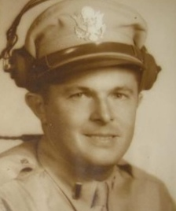
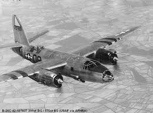

####
Taps
####

:date: 2013-06-10
:tags: Veterans, History

Taps is the song played by a lone trumpeter signaling the end of the day. It is
also played at the funeral of a military hero, signaling his passing into God's
hand. Taps will be played soon, for my good friend Andy Tarapchak, who died
Monday evening, at the age of 93. He was my second Dad, a man I have known all
of my life, and I will miss him.

Andy was living in a nursing home near Annapolis, MD. He spent his days in his
room watching TV, largely the History Channel, or at a table in the front room
of the center with other veterans of WWII. I visited those folks every
Christmas for the last few years. It was always a wonderful time, and a
humbling time, talking to those veterans, and listening to their stories.

Andy joined the Army during WWII and decided to become a pilot. He trained as a
bomber pilot, and practiced his new skills at fields all over the midwest. He
finally was assigned to fly the B-26 Marauder.

After mastering this beast of an airplane, which had a reputation as being hard
to fly, Andy was assigned to fly missions out of England. After D-Day, he moved
his base into France. All told, he flew 71 missions over France and Germany as
part of the Allied effort to defeat Germany. The fact that he survived so many
missions is a tribute to his skill as a pilot, and the support of his crews on
all those flights into harms way. It is also a tribute to the fact that God was
his co-pilot! Far too many pilots never returned from those missions.

Sitting in his nursing home, Andy told of crews returning from missions with
badly damaged planes, and injured crews. On one mission, a B-26 had not been
able to drop it's bombs, but the crew managed to crash-land back at the base
where they were stationed. Andy saw the plane skid to a stop, and remembered
seeing many folks running toward the ship to see if they could help get the
crew out. Andy was too far away to help. The plane exploded, killing the crew
and many of the rescuers as well. War is filled with stories like that. Thank
God for Andy living through all that! 

When the war ended, Andy returned to the US and ended up living in Rosslyn,
Virginia with his new wife, Evelyn. They settled into an apartment at 1510 Key
Blvd, a building that is still there today. Andy went to work for the
Washington Gas-Light Company. His neighbors were the Black family, who had just
had this new kid with the odd name of Roie. Evelyn and Andy adopted this kid as
their own and helped their neighbors adjust to this new job they had. In fact,
they were the best baby-sitters on the planet. Evelyn and Andy would take in
this rug-rat almost any time at all. The kid even learned how to scramble out
of the window of his apartment and walk over to Evelyn and Andy's apartment
window to save some time getting there.

The kid (me) grew up swapping between these two sets of folks. "Evelyn and
Andy" became the name we would use for our favorite people. " I am going over
to Evelyn and Andy's". Or, "I wonder how Evelyn and Andy are doing". 

"Evelyn and Andy" used to take me all over the DC area, and out to the shore.
Many of my best memories from my childhood involve those two.

Andy revisited all the fields where he had trained after coming home. He told
me many stories of finding a field where he had been stationed only to find
cows wandering in them now. He would walk into the fields (avoiding mad cows)
and find chunks of concrete where the old runways had been. I suspect this was
some kind of closure for him. After the war, Andy gave up flying. As many times
as he took me to the Smithsonian to look at old airplanes, he had had his fill
of flying in the war. I do not blame him for that. Was IS Hell!

Andy bought a piece of property near Great Falls and built a nice ranch house
for he and Evelyn. He built it all by himself. He had the basement hole dug
into the ground and I think he had some help getting the foundation in, but he
did all the rest by himself. I remember many trips out to this property to see
how things were going. The basement was always a place of wonder, full of tools
and interesting stuff. On one trip, Andy had an old pin-ball machine torn
apart. I was given a number of switches from that machine, and I pondered how
they worked and what cool things I could make out of them for years!.

Eventually, Andy worked his way up to Vice President of the Washington Gas
Light Company, and when I got old enough to get a job, he always wanted to help
me out. But he managed to turn me into such an aviation freak, there was no way
I wanted to work for the Gas Company, so that never worked out. Instead, he got
jobs for both of my sisters, and one brother-in-law. In fact, both of my
sisters and their husbands worked there for their entire careers. 

Andy knew how much my family loved both him and his wonderful wife, Evelyn. We
will miss both of them immensely. Last Christmas was my last visit with this
great man. Cheryl and I spend about an hour in his room, talking once again
about our lives. He always remembered "Roie Robert", and his eyes would light
up when we walked into the room. On this visit, he was a bit quieter than
normal. But, still the joker, asked us if we knew how old he was. "No, Andy, how
old are you?" "A hundred and five". And he would laugh at the thought. 

On the trip before this last one, I left Andy and went back to the Smithsonian
to look at the airplanes we had examined together when I was a kid. They are
all still there. In the Air and Space Museum, there is a new exhibit of part of a
B-26 from the war.  It is being restored for display at the Udvar-Hazy
facility at Dulles Airport.  I told Andy about that, and about a project to
restore another one to flying status. He listened, but I was not certain how he
felt about it. Flying that beast filled him with many memories, some good, and
many bad. 

Andy, your flying time has just begun. May God grant you the peace that flying
with Him will give you. Thanks for a lifetime of memories for me and my family,
and thanks for guiding me to be the man I am today!

