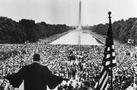

#######################
High School Road Trips 
#######################

:date: 2013-07-16
:tags: Stories

High School is the time when cars tend to be the focus of your life. If you are
a guy, you want one. If you are a girl, you want to know a guy with one. Shoot,
you probably want one too! I wanted one, but my parents were too poor to keep
one, so our family became car-less by the time I entered High School. Phooey! 

..  note::

    Actually, we did have a car, but my dad lost his license, so the car sat in
    front of our house until the city towed it away. I was supposed to get that
    thing when I got old enough for a license, but it was towed a year before
    that.  I still have the key!!!

But I had friends with cars. Some with pretty cool cars, others with something
that had wheels and moved when we fed it with cheap gas! So, my car stories all
involve me riding in someone else's car. 

******************
Dulles Access Road
******************

My best friend, Ron Tinkham, and I were into model airplanes in a big way. So,
everything we did together involved airplanes. I would walk to Ron's house and
we would adjourn to his basement and build airplanes until Red Skelton or Bugs
Bunny came on, then we focused intently on those shows.

Ron had a car of two while in high school, so we would load up our model
airplanes in his car trunk and drive to one of the schools on weekends to fly
the control-line models we built. Those models fly on the end of a pair of
cables about 60 feet long and you go round and round in circles, making the
model go up and down with the handle you hold.  Silly as it sounds today, it
was fun to fly these things, and we had a ball doing so.

..  note::

    Remind me sometime to write baout loding up one of these with lit cherry bombs 
    to see what it would look like blowing up. That gas engine had a few ounces
    of fuel on board. We thought that would make for a neat fireball!

In 1962, Dulles Airport was opened not that far from our High School, George
Mason Jr/Sr. High School in Falls Church, Virginia. To get to that airport, you
had to drive on a brand new limited access highway that took you right to the
terminal building. There was no way to exit the road once you got on it. Of
course we would go to the airport and hang around. In those days, no one had
even thought of anything like the TSA, so we had a lot of fun wandering around
aviation central. We could go just about anywhere in and around the terminal
building.

On memorable day, another of our friends, Tom Kelleher, who had graduated from
High School already, and was attending Purdue University, informed us that he
was coming home for Christmas and would be arriving at Dulles in the dead of
night. A bunch of us told his parents we would pick him up and about four car
loads of us headed to the airport. 

Now, how do you expect four cars worth of kids would drive up a limited access
highway in the middle of the night? The answer is obvious: FAST! We raced to
the airport to see how quickly we could get there. If there were any cops on
the road, we did not see them and made it to Dulles in short order. 

All of us wandered around the deserted terminal building, then headed outside
to the walkway below the tower to see if we could see the planes arriving. The
big problem doing that was that Dulles had a really bad design feature for
aviation buffs. The terminal was quite  distance from the runways and the
aircraft gates. Passengers had to ride in these crazy "people movers" called
"Mobile Lounges".

No, there was no way to get to one of these and hot-wire it. Otherwise, we
might have tried to drag race them down the runways! Tom actually drove school
buses for Fairfax County when he was in school, and rumor has it that he took a
bus to the Manassas Drag Strip to see how fast it would go. It would have been a
fitting tribute to run a couple of the lounges along side of his plane when he
got there.  Right!

After Tom arrived and we all greeted him in the finest traditions we could
think of, we headed out to the parking lot and piled into the cars. Ron, a few
others, and I were in the last car. We decided that on the way back we
would run in a convoy with only the lead car running headlights. All the others
would use the tail-lights of the car in front of them to keep up. Sort of a
formation flight of cars all racing along that cool limited access highway!
That was the plan and off we went.

So, here we are flying at low altitude down the highway when we go under a
bridge and happen to see a patrol car with its light off sitting under the
bridge. All four cars blasted by him, and I am sure he spilled his coffee in
his lap from the shock wave we generated. In any case, a few seconds after we
passed him, his lights came on and he was after us. Ron was a quick thinker. He
screeched to a stop on the side of the road, and all of us jumped out of the
car, threw up the hood, and leaned in looking at the engine as the cop went
blasting by, lights on and sirens wailing! He zoomed past us without slowing
down and disappeared into the night. 

We were all breathing a bit easier, and patting ourselves on the back for
out-smarting the police. That was until we saw the patrol car coming back on
the other side of the road. OMG! He crossed the median and pulled up behind us.
Our goose was cooked, or so we thought.

The cop got out of his car and wandered up to our car. We did our best to
convince him that we had a problem, but we thought it was fixed, and, yes, we
saw those crazy kids go by with their lights off. Did he catch them? Nope!
(Phew!) Then we threw a bunch of questions at him about his car and we got a
tour of the patrol car. What a break! In the end, we drove off with nothing
worse but frayed nerves. Dodged another bullet there!

*********** 
The Beltway
***********

Our adventures in driving were not limited to driving around Falls Church, or
even downtown. (We drove to Georgetown a lot. The drinking age in Virginia was
21, but it was 18 in Georgetown, you figure out the rest!) When they finished
the Beltway, Interstate 495, that circled the entire city in 1961, our goal
became to see who could get all the way around it the fastest. The Beltway was
64 miles long and traveled through Virginia, Maryland, and a bit of D.C.
proper. In the early days, it was a simple four-lane highway, but that was good
enough to make a nice hour or so drive for us. 

The idea of speeding for that long obviously attracted a lot of kids and cars.
Enough so that the police all along the road were arming themselves to do
battle with these outlaw kids. Fairfax County Police supposedly put 500 cubic inch
engines in unmarked Ford Falcons to use on their Beltway patrols. What they did
not think of was that the drive shafts were not up to that much power, so they
snapped a few trying to catch the kids. 

I have a vague memory of my first trip around the beltway. Those who drove this
circuit more than once learned the best places to escape if the police were
spotted. Some of these exits were unfinished exit ramps which we identified as
we drove the loop. I never had a chance to try to escape on one of these. It
might have been fun! (Unless we got caught!)

*****************
Off to Ocean City
*****************

The best road trip I got to take was never actually completed. Ron managed to
get a 1953 Studebaker and a Corvette engine for it. He had the engine rebuilt,
and had it primed for a nice paint job. In August 1963, during the summer
before our senior year, Ron and I decided to do a vacation trip to Ocean City.
So, we packed swim-wear, enough jeans and tee shirts to survive a week, and
added in a few essential food supplies and took off for the ocean! It was a
nice day, nothing but sunshine as we headed around the Beltway toward Maryland. 

As we headed out the highway toward the beach, the car started acting up. The
engine was brand new, but it finally seized up and quit. We later found out
that the rebuild shop forgot to clean out the oil channels in the crankshaft
and the whole thing got way too hot!

That left us on the side of the road, with our plans for the beach going up in
engine smoke. Phooey!

Ron walked up to a nearby house while I protected the car, and called his
mother to come get us. She had to go get a tow-bar for her Rambler station
wagon, them find us way out in Maryland. We obviously had a bunch of time to
kill. So, we twiddled our thumbs and tried to think of something fun to do. Ron
found a roll of masking tape, so we set out to mark the car up like a race car.
We had all kinds of racing stripes on it when a Maryland State Policeman drove
by. He screeched to a stop and proceeded to holler at us for driving a race car
on the public highway. We had to plead with him not to give us a ticket, and
finally he accepted out story and went on his way.

Ron's mom finally showed up and we hooked the "Nude Stude" to the Rambler (oh
the indignity of it all!) and we set off to tow the beast home.  On the way
back, we ended up driving through D.C. and drove past the Lincoln Memorial
toward Memorial Bridge which would get us back into Virginia. What I remember
most about that moment was a huge crowd of people around the Reflecting Pool
and on the steps of the Lincoln Memorial itself. At the top of the steps, I
could see a podium and a small group of people, obviously giving a speech of
some sort.

    "alt: Martin Luther Kink at the Lincoln Memoriel
    :align: center
    :width: 500

It was Martin Luther King, giving his "I have a Dream" speech! To this day,
when I see camera footage of that day, I look out over the crowd looking for
that silly Rambler passing by through the trees along the river. Look closely
at that picture. Is that Rambler in those trees off to the right? So close to
history, and oblivious to it all. Oh the joy of being a kid in D.C. in the 60's.

