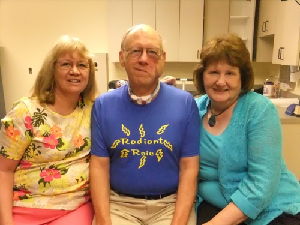

..  _party-redux:

################
Party Time Redux
################

:date: 2013-07-17
:tags: Cancer

Today is my final Radiation Treatment! So, it is time to party - again!

..  note::

    I have to thank Judy (Ingalls) Hughes, my high school classmate, for this
    idea. My wife and sister liked her idea for this tee-shirt enough that we
    had a couple of them made when they went to Fredricksburg, Texas to do some
    shopping last weekend. The shirt was a big hit in the clinic today!

At the end of treatments, the crew throws confetti at you to celebrate completing the
program. Thirty-five days over seven weeks have been spent in the clinic,
letting the machine I named "Herman" do his thing. Dr. Dzuik laid out a program
of shots that covered the area around where the cancer was removed, and erased
any lingering cancer cells that my surgeon could not see through the
microscope. Based on his work last time we are confident the cancer will not
reappear again! Hooray!

*********************
The treatment process
*********************

We took this opportunity to shoot a few pictures of the radiation treatment
process, and the team who helped me through it all.

This is what I looked like on arrival. This is the first close up I have posted
with the clam welded to my cheek. This chunk of skin used to live on my right
leg and extends into my mouth covering the hole in the roof of my mouth created
during my original surgery, and extended during this second one. My mouth is
crooked for now, due in part to the clam pulling things down. This "flap" is
actually shrinking, but it will be a while before that process is done. Then my
plastic surgeon will adjust things and I hope to look fairly normal. For now, I
get to use makeup to tone the skin to blend in with the rest of my face.

Once you get called for the treatment, you need to vocally identify yourself at
the control console outside the treatment room. Then you enter the room and lay
yourself down on the table.

The next step involved placing a cardboard shield coated with something that
blocks the radiation so it will not bounce off my fillings and mess things like
my tongue up! This step is dangerous (for the tech), I might bite her. Does
Scarlett look scared here?

    :Cardboard protector
    :align: center
    :width: 500

After the shield is in place, they bolt my head to the table using the mesh
mask they created before this whole process started. As I have said, the mask
is very tight, and keeps my head in a fixed position. They use a laser beam to
check the alignment of my head for each treatment. The treatment plan needs to
align each shot precisely to make sure they cover the required areas
completely. On more than one occasion, we have had to unbolt the mask and tweak
the positioning to make sure it is right. 

This is Heather getting ready to bolt the mask to the table. 

Apparently, it takes a lot of supervision to make sure this job is done right.
Heather, Scarlett, and John (one of the students learning how to do all this)
made sure I cannot escape. Even with the mask on and the cardboard in my mouth,
I always took time to kid them about all this stuff. In fact, it is all
important if you really want to program to work. These folks take their jobs
seriously, and I appreciate that.  But, it is a tough job, and I hope my
attempts at humor brightened their day!            

Once the mask is firmly in place, and my eyeballs are smashed into the mesh,
the techs leave the room and close a huge, thick, door The only one getting
radiated here is me! I love their comment as they leave: "Here we go". Yep!
They are gone and I am stuck in this room!

After the techs leave the room, I got to sit for quite a while. I accused them
of playing cards for a while but it takes some time to get the program loaded and
everything aligned just right. The table you are on is actually mounted on a
big turn table, so they can rotate it around. The table, itself, can move
around a bit, and "Herman" is also able to move around to give the doctor the
ability to target just about any spot in your body, while avoiding things he
does not want to harm. When the treatment begins, you hear a buzzing sound, but
feel nothing. I did mention that I saw a brief flash of light if the beam was
close enough to my eyes.

My program involved six individual shots, each lasting about 10 seconds.
Between shots, something would move to position things for the next shot.

When the buzzing finally stops, the techs reappear and get me loose from that
mask. Sitting up is a bit of a challenge these days. The only significant side
effect I had during this process was fatigue. I am sure my exercising helped
limit that problem, though.

On a few occasions, they left "Herman" sitting at an angle when they unbolted
me. The first time they did this, I almost fell over convinced that I was
standing sideways! I was not expecting something that massive to be moving
around like it does!

After they unbolted me from the final treatment, My wife and sister came in for
the celebration. They have been a huge help through all this. I really need to
thank both of my sisters for coming out to Texas to help out. They really
helped both Cheryl and me. (Cheryl is not sure she is letting Connie go back
home - HA!)

Here are the two Techs who have helped me through radiation treatments twice
now. Scarlett (on the left) and Heather (on the right) were both a lot of fun
to work with and to tease on a daily basis. 

Finally, I had my normal Wednesday visit with Dr. Dzuik, the boss of the
radiation center. He has been a wonderful guide through all this and I would
not consider having anyone else plan out my radiation work. I am amazed at the
wonderful team he has assembled to do this work. I told him before that I really
am impressed at how well he does this tough job. He has a fabulous sense of
humor, and is always fun to be around. He told me several years ago that this
work can be draining, especially when patients do not make it. But those of us
who survive and live on make it all worthwhile. I am sure that feeling gets all
of these fine folks through as well. I am glad to help out in that regard, Doc!

Thanks to all of the team at Texas Oncology Radiation Clinic.

Now, I get to focus on healing and tuning up that face! Thanks to all of you
who read this blog, prayed for us, and just thought about us during this ordeal.
We all pray none of you ever have to go through anything like this. But, if you
or a loved one do, know that with the right support, and with trust in God, you
can get through the process.
