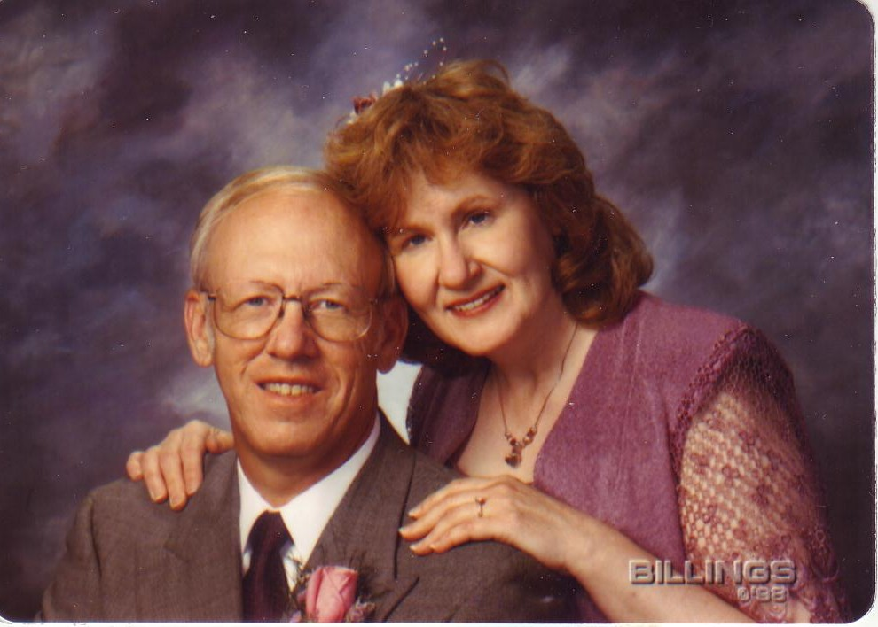
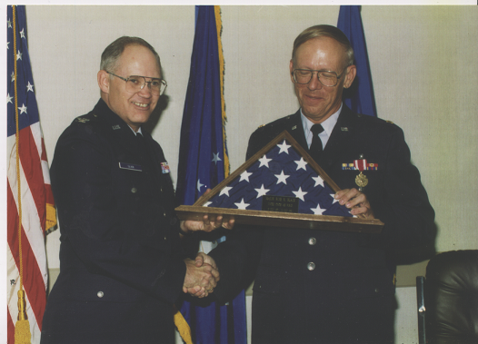

#################
Happy Anniversary
#################

:date: 2013-08-01
:tags: Veterans, Stories

Wow! Today I celebrate two very important events in my life! 

Fifteen years ago, today, I began my journey through life with Cheryl Ann
Black, a wonderful lady I met when I first started up a consulting business in
Omaha, Nebraska. We were married on August 1, 1998 and moved to Austin, Texas
shortly after that so she could accept a new job here.  She has been my rock
during my two adventures with cancer. I will be forever grateful for her
strength and support for all these years, and I hope I have made her life
better as well. We both joke that I have pushed her, kicking and screaming, to
work to her real potential as a financial adviser in the non-profit world. She
is doing amazingly well at that, but is starting to make those retirement
noises. We will see.

The second celebration is my retirement from the United States Air Force. (I
actually retired on July 31, 1993, but the effective date of my retirement is
August 1, 1993, when I became a civilian again!I have now officially been
retired for as long a I served! That seems amazing to me. I miss that part of
my life every day, especially when I see con-trails crossing the sky. It was an
honor to work with so many fine people, all of whom shared a passion for making
sure we have the technology in place that we need to protect this nation. The
jobs I had, the people I worked with, the systems I was responsible for - you
never get a chance to experience any of that unless you swear that oath and
join the Armed Forces of the United States of America. 

Cheryl and I plan on celebrating our anniversary at the beach at Port Aransas,
but that will have to wait a bit. We celebrated our Tenth Anniversary on Kauii, so I may
have to make this a tradition!
