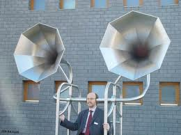
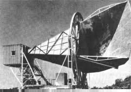

##############
Back to School
##############

:date: 2013-08-31
:tags: Stories

..  note::

    It seems I blasted my old story away here. I ended up duplicating the latest, so I am recreating this entry

Well, I am back to teaching after four months off. I am still tired from the
radiation, and that will take a few months to get over. It is hard getting up
every morning and driving through rush hour traffic to get to my classes.

I was a bit worried about how my clam" would be received. Most of my students
ignored the thing, and listened to my story just fine. In my first class,
though, I finished the class and was cleaning the board when a room full of
girls walked in. (Turns out they are studying art history). WHen they saw my
face, a few of them looked like they were shocked byt Clarance, so I told them
the story. They looked concerned, but did nor run creaming out of the room!
Good!

On two days a week, I start with a 9AM class, and end up at 9PM. That makes for
a long day! I have a long enough break between classes, so I come home to rest
and get ready for the evening class. Then drive about 25 miles to that campus!
The class I am teaching is my assembly language class, my favorite, where I let
the students play with robots. It is a lot of fun, so it is worth the drive.

My biggest concern is my hearing. Dr. Scholl wants to see if the swelling goes
down and things get better by themselves before we work on things. That is
fine, but I am having problems hearing the students. I told my classes I need
to get one of these:

Actually, that looks a lot like I did these last few months. I sat around in my
PJs wearing a yellow tee-shirt a lot. 

If that does not do the job, maybe this one would be better!

That one looks pretty cool! Isn't it fun to switch Google to images when you
search for something. You find all kinds  of neat images!

If all else fails, this is the way I am going:

Do you have any idea what this is. It is well known by most physicists. This is
a radio telescope that picked up the background noise from the Big Bang (No!,
Not the TV show - you need to get out more!). 

**********
Next steps
**********

I will work through this semester as is. My plastic surgeon does not want to do
anything until all the radiation wears off. That means we will do a tune-up in
December. Maybe Santa will give me a new face for Christmas! In the meantime,
teaching is going full steam. I enjoy that, so I endure being tired a lot.
Things are getting better every day!

Thank God, and all of you for your support!

