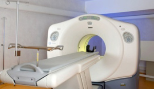

##################
Another Donut Ride
##################

:date: 2013-10-09
:tags: Cancer

Well, it has been almost six months since my surgery, and well long enough since
my last radiation treatment. That means it is time to check things to see if
they really got all the cancer. At least all the cancer they can detect.
Figuring all that out requires a $6000 ride through the "Donut" (aka PET Scan
Machine!)

..  note::

    This afternoon (Oct 10) I got the news that this test came back NO CANCER! YEA!

***********
The machine
***********

This thing lives in a huge semi-trailer so it can move around the area as
needed. It has two rooms, one housing the machine (big) and another where they
prepare you for the ride (small). After a sleepless night, I was pretty tired
when we got there around 1:30 in the afternoon. The place was packed with folks
getting treatments of one kind or another. This is not a good sign! I would
rather the place be a ghost town, meaning we are beating this beast! 

Every time I do one of these tests, I get, well, "concerned", so I did not
sleep well last night. I trust my doctors, but the tests are definitive about
what is going on, and force you to think about everything. Definitely not fun!
In between tests, your mind can basically ignore everything. I suspect this is
a form of denial, but it means I do not spend time worrying about things. 

*********
Prep work
*********

It was only a few minutes until they called my name, and walked me out the side
door to the trailer. Patients are not allowed to climb stairs up to the level
of the machine, we have to ride an elevator. Really? I can do that! NO YOU
CANNOT! Fine! We rode the silly thing up three feet! It took forever. I suspect
a small squirrel cage was powering the thing!

They put me in the little room with a huge chunk of metal that shields the
radioactive stuff you get injected into you for the test. For my kind of
cancer, they use a barium sugar mixture which homes in on any cancer cells in
your body and lights up the image they take with the machine. I had to fast for
a day before the test. No sugar for sure, and mostly just small amounts of
protein and water. I told folks I was on a Bread and Water diet, minus the
bread part! I had to drink a lot of water before the test, and they still made
me drink another bottle before the ride - yikes!

Injecting the stuff was a non-event. I did not glow in the dark, which would
have been pretty cool. I am actually getting used to people sticking sharp
chunks of metal in me in various places. I will tell you what, though! When I
redesign the human body it is going to have a lot of zippers, and sockets for
tubing and other stuff. It would sure be easier than all this poking, prodding,
and occasional cutting they have to do not!

***********
Sleepy-time
***********

You have to wait for 45 minutes while the magic goo finds its way throughout
your body. I was sleepy enough that I dozed off during the wait. During my nap,
those little sugar things were hunting down any of those cancer cells
(actually, it is the other way around. The cancer cells will suck up any sugar that
floats by!) Then they take you into the big room, lay you down on the machine,
and strap you down for the ride. 

********
The ride
********

The ride is another big boring adventure. You just move back and forth through
the donut-hole while these weird "positrons" zing through your body. The actual
beam seems to come from a rotating ring that spins around you as you move
through it. The image the machine produces is a full 3-D thing doctors can cut and slice as
they wish to explore every tiny part of your body! I have looked at some of those
images, but it would be interesting to explore them they way a doctor does. In the
end, they will report the findings.

*******
Wrap-up
*******

Once the ride was over (about 2 hours for the entire thing), they unwrapped me,
made me ride the silly elevator again, and shoved me back into the waiting
room, where Cheryl was having her own adventure!

*******
Waiting
*******

Apparently the crowd in the waiting room was pretty wild. Some were quiet, some
were loud, most seemed to want to make sure Cheryl knew everything about their
problem, their treatment, and their family history. Cheryl was pretty wiped out by
it all, and more than ready to ditch this place and go home! So we wandered out
the front door toward the car.

The funniest thing we saw during the whole (hole?) ordeal was a pair of bumper
stickers on a tiny Honda in the parking lot. It said "F*** Cancer" on one side,
and "I wish cancer would get cancer and DIE!" on the other side. Pretty well
sums things up!

*******
Finally
*******

Now that the test was over, I could have food again. So we headed to our
favorite diet place. We both had DQ Blizzards to celebrate! DQ must have donut
flavored Blizzards on sale. The place was being overrun with police cars. They always
hang out where the donuts are, right? The only problem I have now is waiting until my
Oncologist reads the image. My appointment with him is a week away. I am not
sure I want him to call before that, or not. I will worry regardless, until I
hear the answer. God willing (and listening to all of your prayers) we will get
good news!

**********
Postscript
**********

Today (the next day) I got a phone call from my Oncologist. Boy is hearing that
call (and seeing the caller ID) nerve wracking! The nurse who was on the line
told me that the PET scan looked "pretty good" and they would see me next week!
PHEW! Looks like God was willing! Thank you God, and all my support folks!

