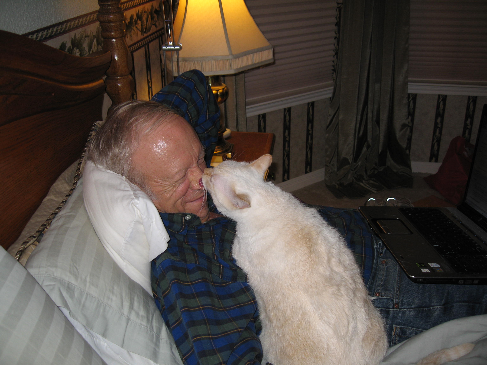

#############
Mister Victor
#############

:date: 2013-10-23
:tags: Cancer

This morning, Cheryl and I said goodbye to one of our Kitties. Victor was about 11,
and he had cancer. (Cancer SUCKS, by the way!). 

Over the last few days, he went downhill fast. His chest filled up with so much
fluid we had to tap it to draw off enough so he could breathe. We did that
three times over the last four days. He put up with it, but got weaker and
weaker. This morning, after hearing from a Kitty Oncologist, we knew that all
we could do is give him a few more months, and that his quality of life would
be poor at best. He was suffering, so we decided to end his suffering.

Now we are suffering.

We humans take in pets for a variety of reasons. I like to believe that we give
them the best possible life they could have. In exchange, they enrich our
lives, far beyond the pain we feel when we lose them. Victor certainly did that for
us.

***************
Rescuing Victor
***************

Victor was a rescue kitty, brought to the Austin Humane Society while Cheryl
was Executive Director there. He had been picked up off the streets of
Victoria, Texas near the Gulf coast, and brought to Austin because the Austin
facility was a "no kill" center. However, once the folks at AHS took him in,
they discovered that he had Feline Immune Deficiency, (called FIV - kitty Aides),
and he could not be adopted out. The techs in the center brought him to Cheryl
and asked if she would like to adopt him! If not, he would have to be put to
sleep. They knew that we had another FIV cat already, Snowball. Cheryl and I
talked about this, took him in for checkups, and in the end, decided to bring
him home.

Victor got his name by accident. When they took him in at the Humane Society,
they needed to enter a name in the computer. Whoever did that, just filled in
the name field with Victor, because he came from Victoria. Everyone loved that
name, he was the only Victor most folks who worked with him had ever met.

******************
Victor, AKA "Thug"
******************

Victor was a pudgy little kitten when we got him, As he walked away, he had a
kind of swagger in his walk. I thought he looked a bit like Mickie Rooney from
all those old movies, at least in his attitude! So we nicknamed him "Thug". It
was kind of appropriate, since the first thing he did when joining our family
was to try to beat up Snowball and become "top cat"! It did not really work,
but he kept trying. He would walk by Snowball, and just reach over and bite him
for no apparent reason. Not being mean, exactly, just seeing if he was the boss
yet.

************
Victor on TV
************

Right after we took him in, the Humane Society had a fund-raising event that
was televised on an Austin TV station. One of the local newscasters, Fred
Cantu, hosted the event, They wanted to do a live shot with some owners and
their new adopted pets, so Cheryl and I decided to put Victor on TV.

Everything went well, except that Victor did not like all the attention. He was
pulled from the streets of Victoria and a few days later on camera! This is
crazy, folks.

In any case, during the interview, I held Victor, and he was visibly nervous.
When Fred reached over to pet him, Victor practically took him out. He let out
a screech, and took a swipe at poor Fred. (We have video-tape of the whole
encounter!) I managed to keep hold of Victor, and I do believe no blood was drawn,
but not for lack of trying on Victor's part.  Needless to say, Victor's days on
TV were over. I suspect Fred thought twice about interviewing anyone holding a
cat as well!

*********** 
Exfoliating 
***********

He and I got along famously. That picture up above was taken while I was
recovering from one of my runs with cancer. Victor would jump up and
"exfoliate" my face. OMG, did he have a rough tongue! He knew I did not feel
well, and was doing his part to make me feel better! In the image above, he was
working on my nose. Other times he seemed to want to make sure my eyebrows were
hyper clean. I would leave one of those encounters with sore eyebrows. He would
purr furiously while doing this. 

He never did this with Cheryl. Any time I scratched him, he would bend around
to try to lick me. It was like he had to lick something. Once he got started,
you were in for a treatment! It was cute!

****
Food
****

Like most cats, food was the center of Victor's life. Both Victor and Snowball
were front and center any time we had food around. Even if they were hiding
somewhere in the house, all we had to do was act like we were headed for the
kitchen, and both cats would bolt through the house to help us prepare their
meals. They would climb up into chairs and watch while dinner was being made.
Victor would jump up on the counter and come over to make sure it was being
done right. We could move him off, but he would not take NO for an answer, and
he would be back in our faces in a heartbeat. (Remember you cannot train cats,
only dogs! Dogs have masters, cats have servants!)

Cheryl was firmly behind Victor in the pecking order in this house. Early in
the mornings, Victor would decide it was time for breakfast (like at 5:30am!)
He would carefully jump up on the bed, and crawl up behind Cheryl's head and do
one of two things to her: either bite her hair (gently), or purr so loudly he
woke her up. Cheryl always fell for this, and struggled out of bed to feed the
kitties when they decided it was time. 

Me, he never bothered. Even when Cheryl was away on a trip, both cats left me
alone. They were eager for breakfast when I finally woke up, but Victor did not
try to wake me up, just Cheryl.

*************************************
Take care of the animal, not yourself
*************************************

As things went downhill over the last few days, one of Cheryl's good friends and
mentors told us that he had worked very hard to keep his cat going even when
doing so was not going anywhere. In the end, he realized that he was thinking
of himself, not his cat in all that he did to try to keep him going.  We were
reminded of that as we made decisions to help Victor. We got him to the Vet and
did what we could to make him comfortable.  When it looked like it was cancer,
we got him to a specialist to make sure what we were dealing with. We took him
to the emergency rooms when he was clearly having to struggle to breathe. When
we woke up this morning, both Cheryl and I knew that it was not going to get
better, and we had to think of Victor. We could not magically make him better,
but we could end his suffering.

Both Cheryl and I held him, and stoked his head as the Vet gave him the final
shot. I was looking right in his eyes, and could not see when his little kitty
soul left us. But leave us it did.

Cheryl and I had a little memorial service for him at home this evening. Cheryl
found some verses from the Bible. We read them as we remembered life with our
little guy! 

Mister Victor, thank you for being part of our lives. We both treasure the time
we got to spend with you. We will remember you for the rest of our lives!

